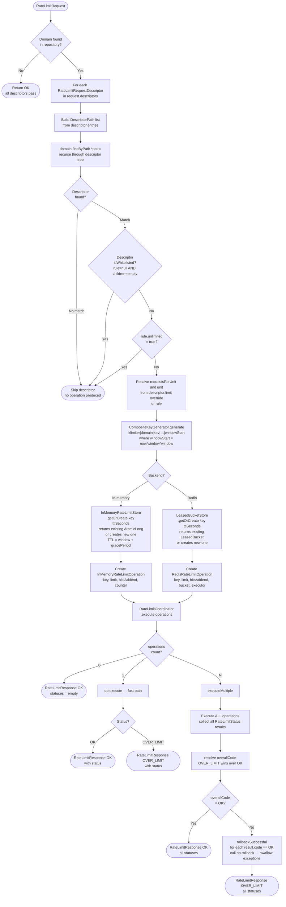
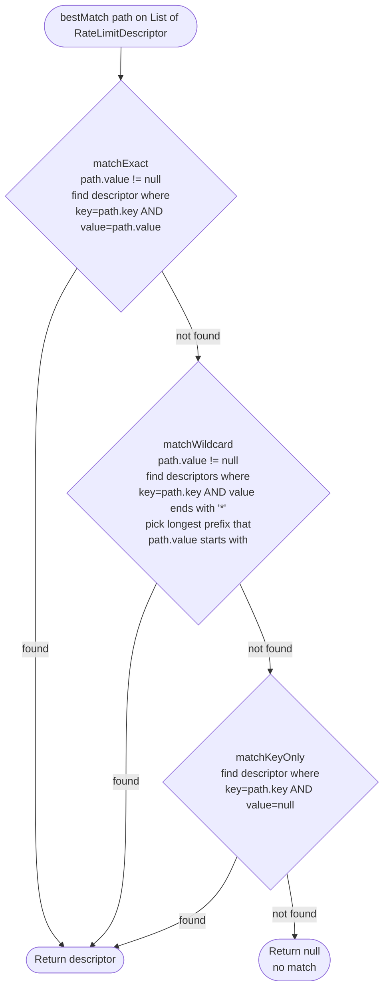
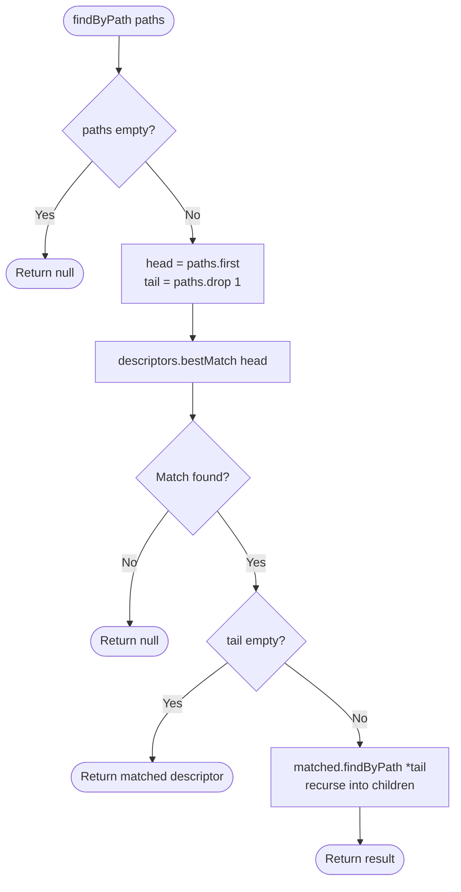
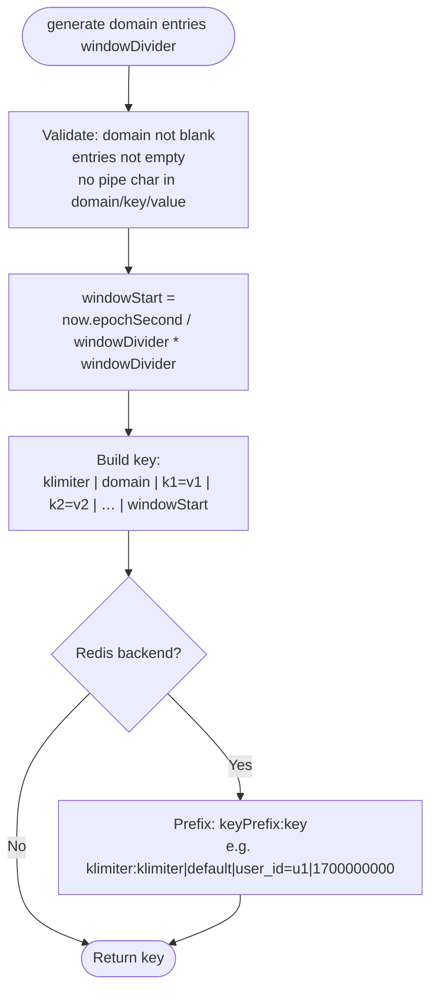
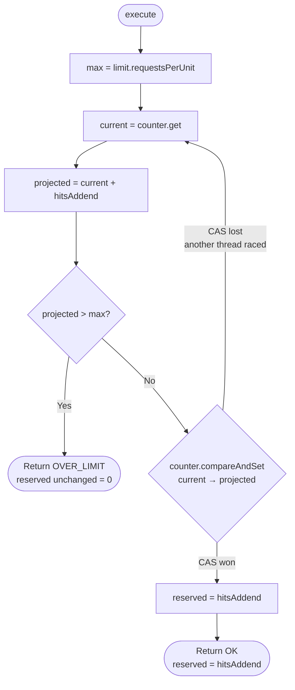
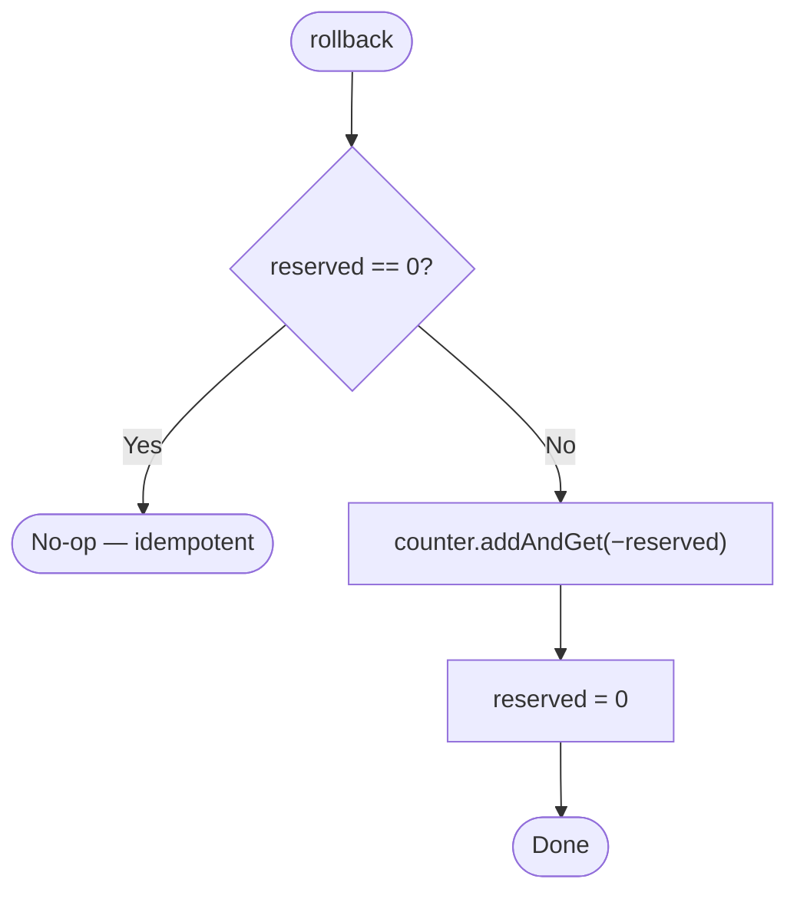
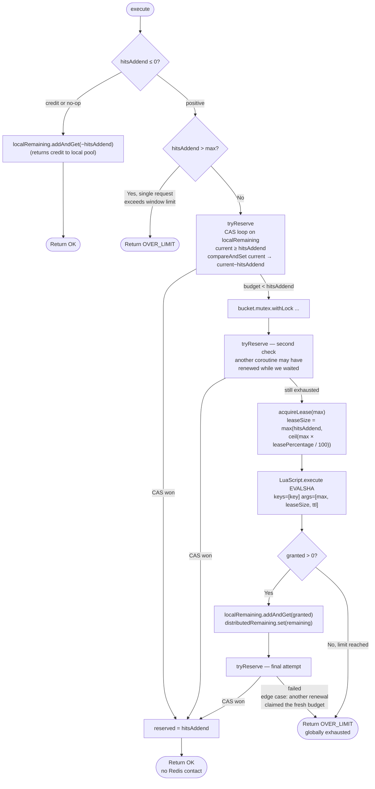
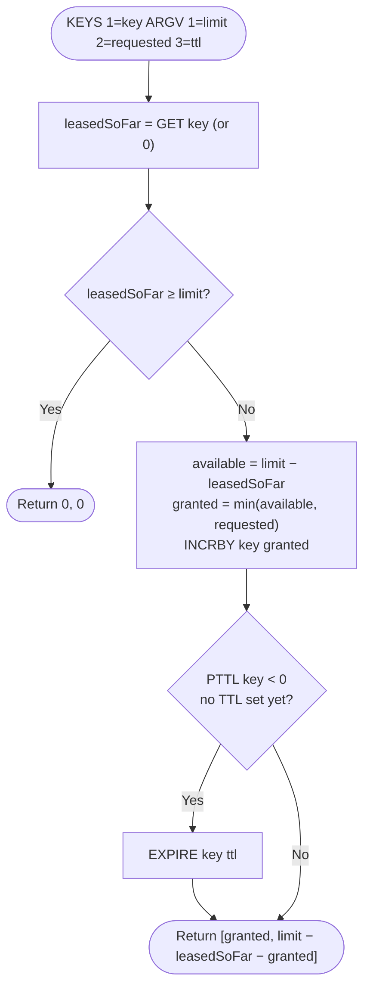
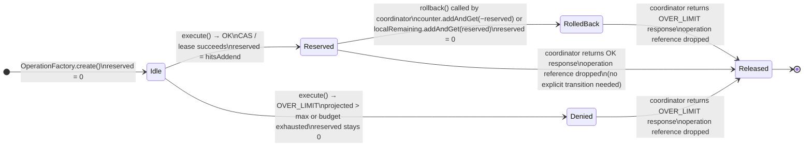
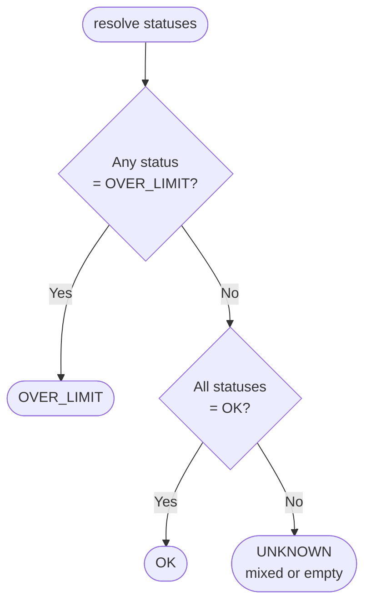

# Algorithms

**See also:** [Architecture](ARCHITECTURE.md) — component overview · [Flows](FLOWS.md) — sequence diagrams that trace these algorithms end-to-end

---

## 1. Rate limit decision — full flowchart

Covers both in-memory and Redis backends. The fork only happens after the bucket key is resolved.

---

## 2. Descriptor matching algorithm

Called by `MatchEngine.bestMatch(path)` on each level of the descriptor tree. Precedence is fixed: **exact → wildcard → key-only**.

Multi-entry descriptors (e.g. `[user_id=u1, plan=free]`) are matched by walking the tree recursively: the first entry is matched against `domain.descriptors`, the second against the matched descriptor's `children`, and so on.

---

## 3. Time-bucketed key generation

`CompositeKeyGenerator` produces keys that encode the current rate-limit window so that each window maps to a distinct counter bucket.

The `|` separator is rejected in domain names, keys, and values because it would make the composite key ambiguous. This is enforced at key-generation time with an `IllegalArgumentException`.

---

## 4. In-memory reservation — CAS loop

`InMemoryRateLimitOperation.execute()` is entirely lock-free. The loop retries only on lost CAS races, not on limit decisions.

---

## 5. Redis lease algorithm

`RedisRateLimitOperation.execute()` has three decision levels before contacting Redis. The Lua script is only reached when the local budget is fully exhausted and no concurrent renewal already refreshed it.

**Lua script logic** (`LeaseScripts.LEASE_ACQUIRE`):

---

## 6. Reservation lifecycle — state machine

Each `RateLimitOperation` instance is created per-request and discarded after the coordinator returns. The `reserved` field tracks whether this instance holds an active reservation.

**Key invariants:**

- `rollback()` is idempotent: if `reserved == 0` it is a no-op.
- The coordinator only calls `rollback()` on operations whose `execute()` returned `OK` (i.e. those that transitioned to `Reserved`).
- For the Redis backend, `rollback()` never contacts Redis — it only returns hits to the local `LeasedBucket`. At most one lease-slice can be leaked on a failed multi-descriptor batch.
- An operation in `Denied` state has `reserved == 0`; calling `rollback()` on it is safe and is a no-op.

---

## 7. Overall code resolution

The coordinator delegates to `RateLimitOverallCodeResolver.resolve(statuses)`.

