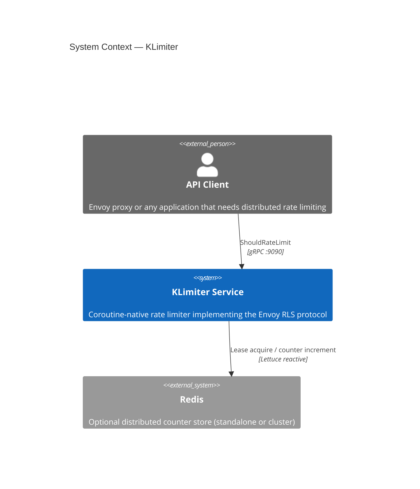
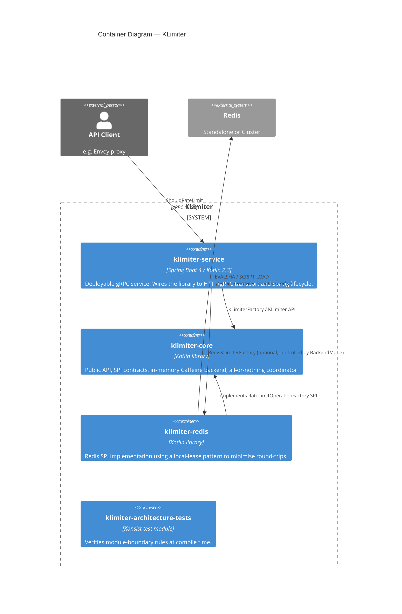
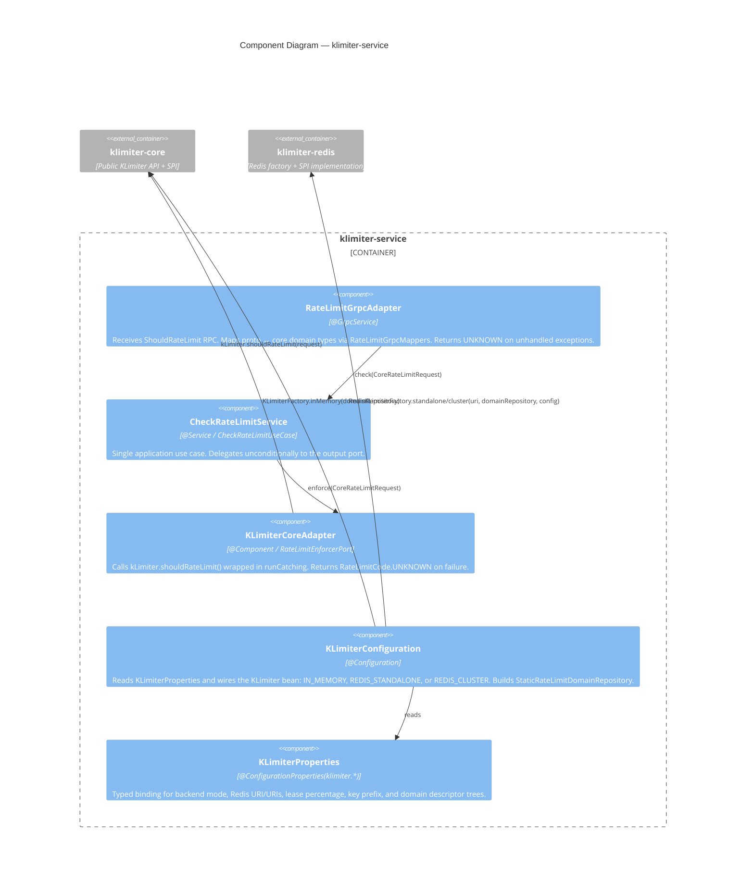
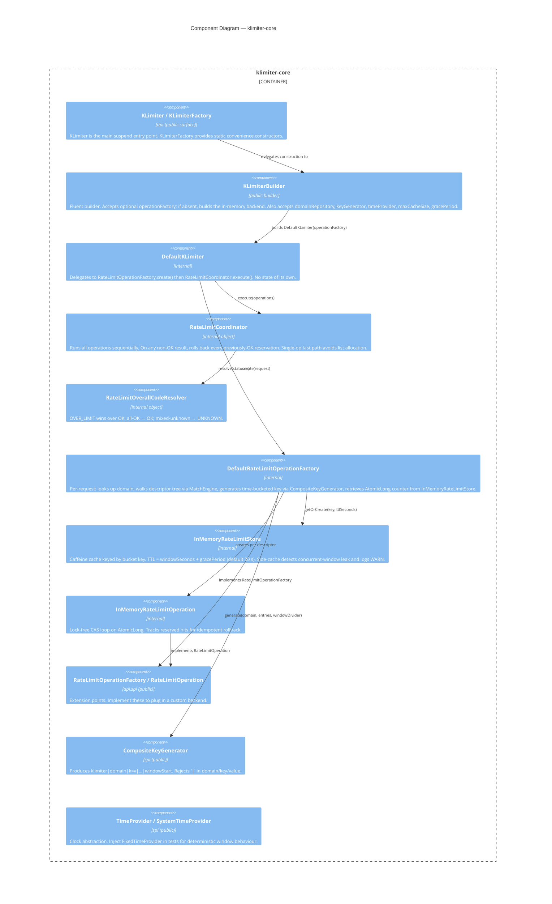
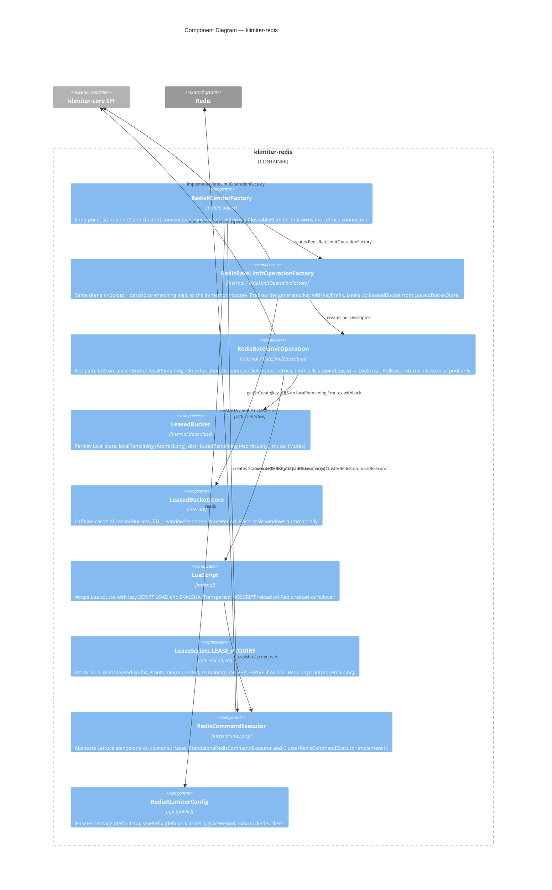

# Architecture

KLimiter is a multi-module Gradle project. The three core modules have a strict layering: **klimiter-core** is the rate-limiter library, **klimiter-redis** is an optional Redis backend implementing the core SPI, and **klimiter-service** is the deployable Spring Boot gRPC service.

---

## C4 — System Context



---

## C4 — Container Diagram



---

## C4 — Component Diagram: klimiter-service



---

## C4 — Component Diagram: klimiter-core



---

## C4 — Component Diagram: klimiter-redis



---

## Module dependency direction

```
klimiter-service ──▶ klimiter-redis ──▶ klimiter-core
       │                                     ▲
       └─────────────────────────────────────┘
```

Rules enforced by `klimiter-architecture-tests` (Konsist):

- `klimiter-core` must not depend on Redis, Spring, or gRPC.
- `klimiter-redis` must not depend on `klimiter-service`.
- Service domain (`domain.model`, `domain.port`) must not import adapters, Spring, gRPC, core, or Redis directly.
- Service application layer must not import transport or backend adapters.
- Hexagonal package layout (`adapter`, `application`, `domain`) must exist in the service module.
