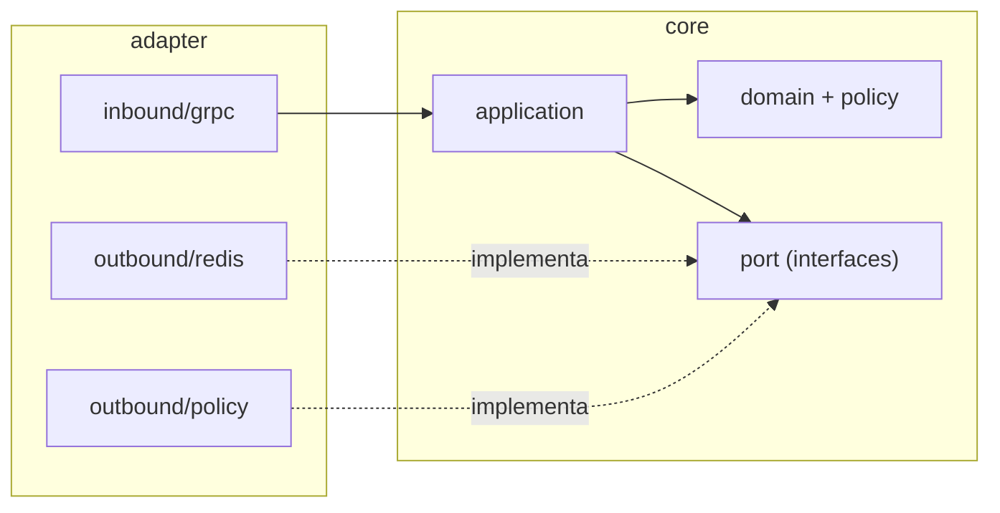

# Arquitetura — klimiter

Define a **estrutura do código** do klimiter e as **regras** que a governam: estilo
arquitetural, camadas, layout de pacotes e a regra de dependência. É um documento **normativo** —
descreve fronteiras e restrições, não escolhas de implementação.

> **Onde este documento se encaixa.**
>
> | Documento | Responde | Fonte da verdade de |
> |-----------|----------|---------------------|
> | [`DESIGN-CONCEITUAL.md`](DESIGN-CONCEITUAL.md) | **o quê** — fluxos, invariantes, premissas | comportamento |
> | **`ARQUITETURA.md`** (este) | **como o código é estruturado** — camadas, fronteiras | estrutura |
> | [`CONTRIBUTING.md`](../CONTRIBUTING.md) | como **interagir** com o projeto | git flow, qualidade |
> | [`AGENTS.md`](../AGENTS.md) | quickref operacional | comandos e convenções |
>
> Referências `§N` apontam para seções do `DESIGN-CONCEITUAL.md`. Se o código divergir desta
> estrutura, é bug; se a estrutura mudar, atualize este documento no mesmo PR.

---

## 1. Estilo arquitetural

O klimiter segue **Arquitetura Hexagonal (Ports & Adapters)**. O domínio e a aplicação são o
centro; tudo que fala com o mundo externo (gRPC, Redis, sistema de arquivos) é periferia,
acoplado ao centro **apenas por interfaces** definidas pelo próprio centro.

---

## 2. Camadas e responsabilidades

| Camada | Pacote | Responsabilidade | Pode depender de |
|--------|--------|------------------|------------------|
| **Domínio** | `core.domain` | Value Objects, agregado local, enums (`Status`, `Priority`). Estado e invariantes do limite. | nada (só Kotlin/stdlib) |
| **Política** | `core.policy` | Snapshot de políticas, resolução por precedência (§8.1), derivação de janela/chave/TTL (§3). | `core.domain` |
| **Portas** | `core.port` | Interfaces das fronteiras: entrada (`inbound`) e saída (`outbound`). | `core.domain`, `core.policy` |
| **Aplicação** | `core.application` | Orquestração do lote all-or-nothing (§7) e dos fluxos de prioridade (§5, §6). | tudo de `core` |
| **Adapters** | `adapter.*` | Tradução entre o mundo externo e as portas. | `core` |

O conjunto `core.*` é o **núcleo**: não conhece framework, transporte nem armazenamento.

---

## 3. Layout de pacotes

Raiz: `io.github.rodrigogurgel.klimiter`.

```
io.github.rodrigogurgel.klimiter
│
├─ core/                      # núcleo: domínio + aplicação. Sem Spring, gRPC, Lettuce ou IO.
│  ├─ domain/                 # Value Objects, agregado local, enums (Status, Priority)
│  ├─ policy/                 # snapshot de políticas, resolução (§8.1), janela/chave/TTL (§3)
│  ├─ port/
│  │  ├─ inbound/             # EvaluateUseCase (porta de entrada)
│  │  └─ outbound/            # Central, Clock, PolicyRepository (portas de saída)
│  └─ application/            # impl. do use case (lote all-or-nothing, §7) e fluxos de prioridade
│
└─ adapter/                   # periferia. Depende de core; o core nunca depende daqui.
   ├─ inbound/grpc/           # RateLimitService (Spring gRPC) + tradução proto↔domínio
   └─ outbound/
      ├─ redis/               # Central via Redis (porta outbound)
      └─ policy/              # carga e observação de config/policies/policies.yaml (PolicyRepository)
```

> **Nota Kotlin:** `in` e `out` são palavras reservadas — os segmentos de pacote são
> `inbound`/`outbound`, nunca `in`/`out`.

---

## 4. Regra de dependência

**As dependências apontam só para dentro.** `adapter → core`. O `core` não conhece nenhum
pacote `adapter`, nenhum framework e nenhuma biblioteca de transporte/armazenamento.



As portas de saída (`Central`, `Clock`, `PolicyRepository`) são **declaradas no core** e
**implementadas no adapter**: a dependência de runtime aponta para fora, mas a dependência de
código-fonte continua apontando para dentro (inversão de dependência).

---

## 5. Regras de fronteira

Normativas. Devem valer em todo commit.

- **R1 — Núcleo isolado.** `core.*` não importa Spring, gRPC, Lettuce/Redis, o proto gerado
  (`io.github.rodrigogurgel.klimiter.grpc.v1`) nem APIs de IO/sistema de arquivos. Tempo só pela
  porta `Clock`; armazenamento só pela porta `Central`; políticas só pela `PolicyRepository`.

- **R2 — Contrato externo fica na borda.** O contrato gRPC (`RateLimitRequest`,
  `RateLimitResponse`, `RateLimitDescriptor`, `RateLimitDecision`) e sua tradução para o
  contrato interno do domínio existem **somente** em `adapter.inbound.grpc`. O `core` expõe um
  contrato próprio, independente de proto.

- **R3 — Portas no core, adapters fora.** Toda interface de fronteira vive em `core.port`. Toda
  implementação que toque tecnologia externa vive em `adapter.*`. Um adapter implementa portas;
  nunca o contrário.

- **R4 — Sentido único.** Nenhum tipo de `adapter` aparece em assinatura, campo ou retorno de
  `core`. A comunicação adapter→core passa pelas portas.

- **R5 — Domínio sem primitivos soltos.** Conceitos do domínio (dimensão, valor, hits,
  capacidade, janela, TTL, prioridade, status, remaining) são Value Objects com invariantes no
  construtor — não `String`/`Int`/`Long` cruos cruzando fronteiras internas.

- **R6 — Código gerado é intocável.** O proto gerado em `build/generated/` não é editado e só é
  referenciado por `adapter.inbound.grpc` (consequência de R1/R2).

- **R7 — A regra de dependência é testada.** As regras acima são verificadas por um teste de
  arquitetura com [`konsist`](https://docs.konsist.lemonappdev.com) (já no version catalog), que
  falha o build quando violadas — fronteira executável, não convenção informal.

---

## 6. Determinismo distribuído

A derivação de janela e da **chave determinística** (§3.2) é responsabilidade de um único ponto
em `core.policy`. É invariante arquitetural: todos os nós, para a mesma janela, produzem a mesma
chave. Esse cálculo não se espalha por adapters nem se duplica.
