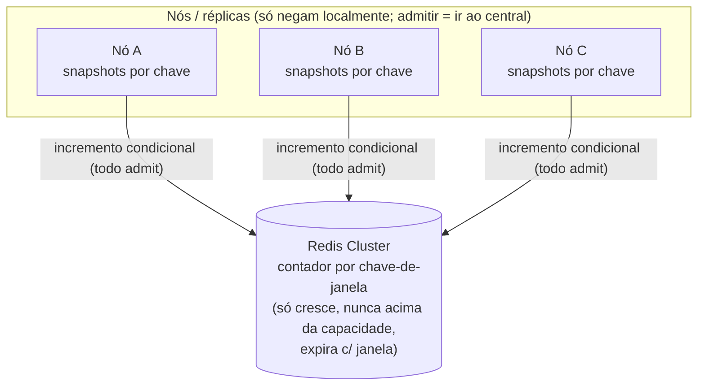
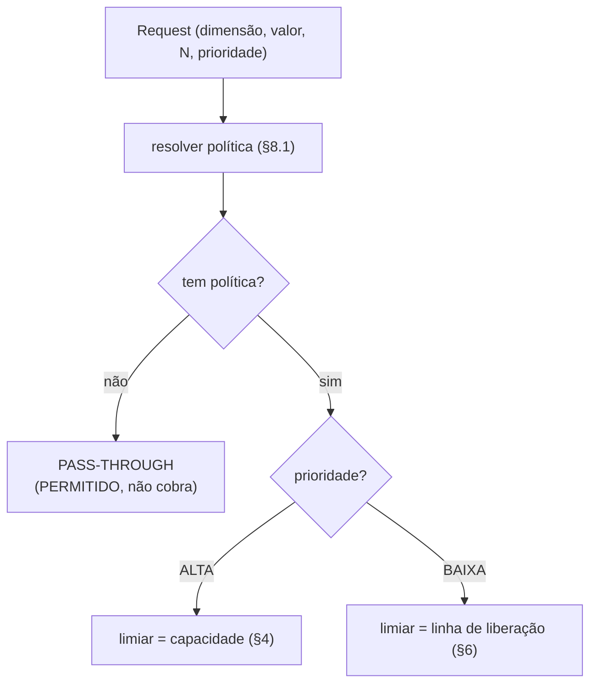
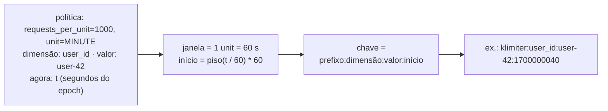
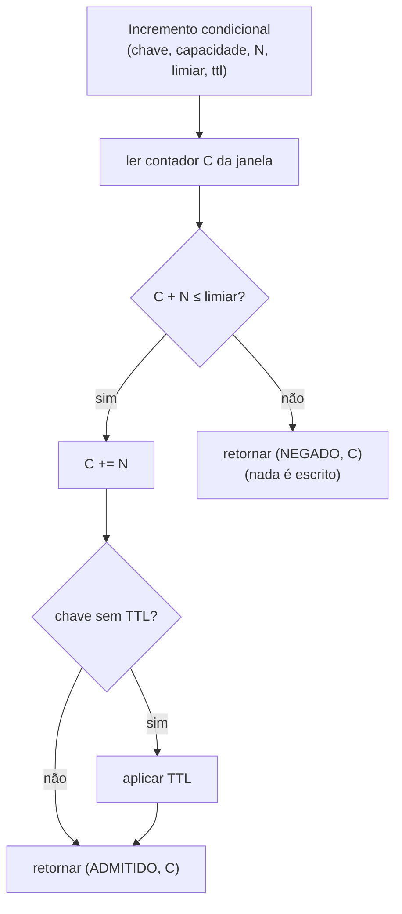
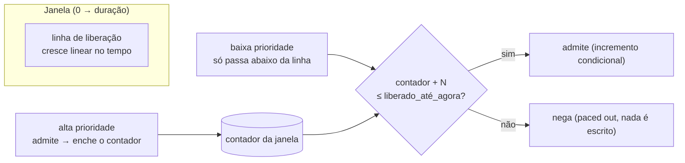
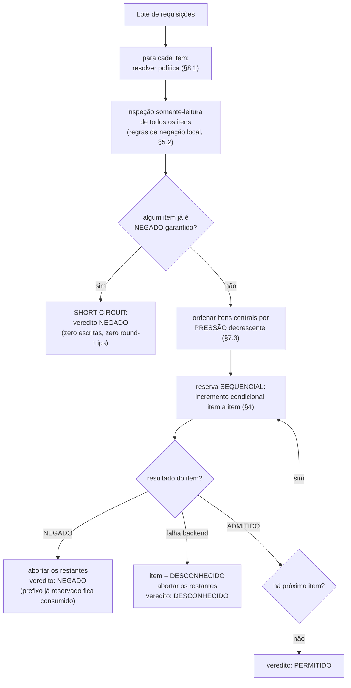
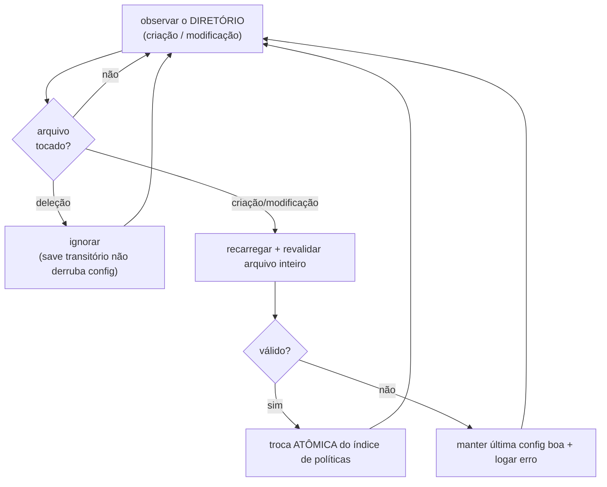
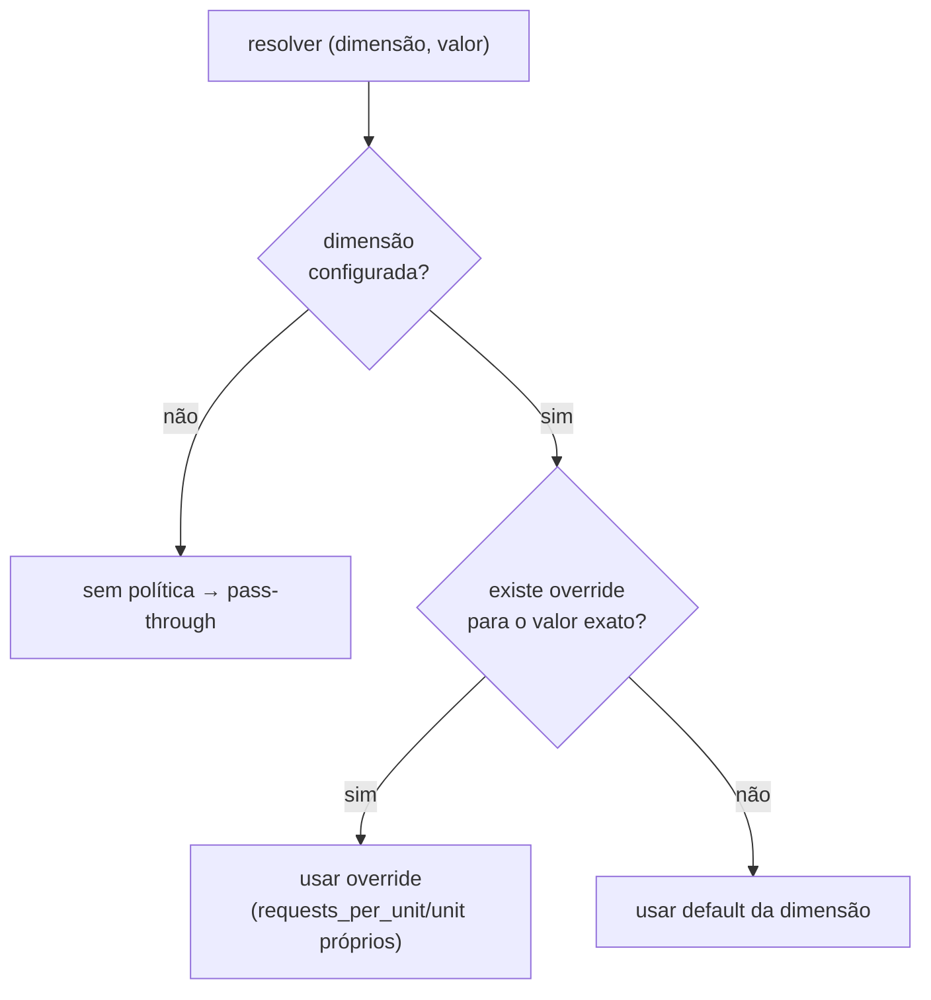

# Design Conceitual v2 — Rate Limiter Distribuído

> Especificação da **lógica** dos fluxos, independente de linguagem ou framework.
> Descreve o que cada parte deve fazer e por quê — não nomes de classes ou métodos.
>
> **Nota de origem.** Este design substitui uma arquitetura anterior baseada em *leases*
> locais (blocos de capacidade arrendados por nó, com refund local). Sob lote
> multi-dimensão de baixa prioridade com dimensões saturadas, aquela arquitetura colapsou
> em teste de carga (~2k servidos de 6k possíveis): o refund só-local queimava a linha de
> pacing das dimensões irmãs, e o orçamento arrendado fragmentava entre réplicas. Este
> design elimina a camada de lease: **toda admissão é decidida no armazenamento central,
> por incremento condicional atômico, sem refund**. O nó local apenas *nega* — nunca
> admite sozinho. O racional completo da mudança está no
> [Apêndice A](#apêndice-a--histórico-a-arquitetura-anterior-e-por-que-foi-substituída).

---

## Índice

1. [Modelo mental](#1-modelo-mental)
2. [Contrato de entrada e saída](#2-contrato-de-entrada-e-saída)
3. [Chave determinística de janela](#3-chave-determinística-de-janela)
4. [Operação central: incremento condicional atômico](#4-operação-central-incremento-condicional-atômico)
5. [Estado local: snapshot monotônico e negação local](#5-estado-local-snapshot-monotônico-e-negação-local)
6. [Pacing: a linha de liberação contínua](#6-pacing-a-linha-de-liberação-contínua)
7. [Batch all-or-nothing: inspeção + reserva ordenada por pressão](#7-batch-all-or-nothing-inspeção--reserva-ordenada-por-pressão)
8. [Hot reload de políticas](#8-hot-reload-de-políticas)
9. [Invariantes de corretude](#9-invariantes-de-corretude)
10. [Limitações conhecidas](#10-limitações-conhecidas)
11. [Premissas operacionais](#11-premissas-operacionais)
12. [Desempenho e dimensionamento](#12-desempenho-e-dimensionamento)
13. [Observabilidade](#13-observabilidade)

---

## 1. Modelo mental

É um **rate limiter distribuído por janela fixa (fixed window)**, no modelo do **Envoy
RLS**: um serviço stateless (para fins de decisão) na frente de um armazenamento central
(Redis Cluster), com **um contador por chave-de-janela**. Toda admissão é um **incremento
condicional atômico** nesse contador: incrementa somente se o resultado couber no limiar
(capacidade, ou linha de pacing para baixa prioridade); caso contrário nega **sem
escrever**.

Quatro ideias sustentam todo o resto:

- **A verdade global é um contador por janela, e ele só cresce.** Não há refund: unidades
  consumidas por um lote que acabou negado ficam consumidas até a janela expirar. O
  incremento é condicional, então o contador **nunca ultrapassa a capacidade**.
- **O nó local só nega; nunca admite.** Cada resposta do central ensina ao nó o valor do
  contador (snapshot). Como o contador só cresce, o snapshot é um **limite inferior seguro**
  do consumo real — suficiente para negar localmente, de graça, tudo que o central
  garantidamente negaria. Admitir exige sempre o round-trip.
- **Duas prioridades, um contador.** A alta é limitada só pela capacidade da janela; a
  baixa passa por uma **linha de liberação contínua** (pacing) validada contra o mesmo
  contador. Alta consumindo forte empurra a baixa para fora da linha, naturalmente.
- **Lote all-or-nothing com reserva sequencial ordenada por pressão.** Itens do lote são
  reservados um a um, do mais provável de negar para o menos provável; a primeira negação
  aborta o resto. O desperdício de um lote condenado fica limitado ao prefixo já reservado
  (§7, §10).



O trade-off assumido conscientemente em relação à arquitetura anterior: **todo request admitido paga
round-trip(s) ao central** — exatamente como o Envoy RLS opera. Em troca, não existe
capacidade presa em nó nenhum: sub-admissão por lease encalhado, refund local e
fragmentação entre réplicas desaparecem **por construção** (§12 mostra que o custo de
latência/throughput cabe com folga nos requisitos).

---

## 2. Contrato de entrada e saída

### 2.1 Entrada (request) e saída (decisão)

O contrato de uma requisição individual e sua resposta, independente de transporte ou
serialização:

**Request**

- `dimensão` (campo `key` no proto) — o eixo do limite (ex.: `user_id`).
- `valor` — o valor concreto dentro do eixo (ex.: `user-42`).
- `N` (hits) — unidades que esta requisição quer consumir (tipicamente 1).
- `prioridade` — `ALTA` ou `BAIXA`.

Um pedido do cliente é um **lote** de um ou mais requests, avaliado all-or-nothing (§7).

**Decisão (por request)**

- `status` — `PERMITIDO` | `NEGADO` | `DESCONHECIDO` (enum compartilhado por alta e baixa).
- `remaining` — capacidade restante na janela (`capacidade − contador`; exata quando o item
  foi ao central, estimada pelo snapshot quando negado localmente; 0 quando negado por
  esgotamento).
- `reset_after` — quanto falta para a janela virar.
- `capacity` — a capacidade da política (`requests_per_unit`).

O **resultado do lote** carrega o `status` coletivo (§7) mais a decisão de cada item.

### 2.2 Roteamento de uma requisição

Antes de qualquer reserva, resolve-se a política. Sem política casada, a requisição é
**pass-through** (admitida, não cobra nada). Com política, o limiar da operação central é
escolhido pela prioridade.



O pass-through é decidido **aqui**, na resolução de política (§8.1) — não dentro da reserva.

---

## 3. Chave determinística de janela

### 3.1 Modelo de política: requests por unidade

A política segue o modelo **Envoy RLS**: cada regra é **`requests_per_unit` + `unit`**, e
**não** uma duração arbitrária.

- **`requests_per_unit`** — a capacidade: quantas requisições são permitidas por **uma**
  unidade de tempo.
- **`unit`** — a unidade da janela: `SECOND`, `MINUTE`, `HOUR`, `DAY`, … A **janela tem
  sempre o tamanho de exatamente uma unit**. Não existe "a cada 10 segundos" nem "a cada
  90 minutos"; existe "N por SECOND", "N por MINUTE", "N por HOUR", "N por DAY".

Ao longo deste documento, "capacidade" significa `requests_per_unit` e "janela" significa o
comprimento de **uma** `unit` (convertido para segundos).

| `unit`   | comprimento da janela | fronteira de alinhamento (epoch/UTC) |
|----------|-----------------------|--------------------------------------|
| `SECOND` | 1 s                   | a cada segundo                       |
| `MINUTE` | 60 s                  | topo do minuto                       |
| `HOUR`   | 3600 s                | topo da hora (UTC)                   |
| `DAY`    | 86400 s               | meia-noite (UTC)                     |

### 3.2 Derivação da chave

Toda a coordenação depende de nós diferentes calcularem **exatamente a mesma chave** para
a mesma janela de tempo.

**Responsabilidade:** transformar `(dimensão, valor, instante atual, unit)` numa chave
estável e no conjunto de números de tempo que a operação central e a negação local
compartilham.

Regras:

- A janela é **alinhada ao epoch (UTC)**, tomando o piso da divisão do instante atual pelo
  comprimento da unit. Não é relativa ao primeiro request nem ao fuso local. Assim todo nó,
  para a mesma janela, converge na mesma chave. (Para units que não dividem o dia de forma
  exata a fronteira "deriva" em relação ao relógio de parede, mas continua idêntica entre
  nós — o que basta para a coordenação.)
- O **início da janela (em segundos do epoch) é embutido na chave**. Cada janela vira uma
  chave distinta; não há "reset" de contador — a janela antiga simplesmente expira (TTL =
  comprimento da unit + um período de carência).
- O valor armazenado na chave é **quanto já foi admitido** naquela janela, não o que
  resta.
- Cada operação toca **uma única chave**. Isso é o que torna o design **compatível com
  Redis Cluster**: cada chave roteia para seu slot/shard naturalmente, sem hash tags nem
  operações multi-shard, e os buckets se espalham pelo cluster.
- O mesmo instante e a mesma unit calculados no nó são repassados à operação atômica
  central, para que a matemática de janela do nó e do armazenamento **coincidam
  exatamente** (essencial para o pacing — ver §6).



---

## 4. Operação central: incremento condicional atômico

É a **única** operação de escrita do sistema. Substitui o par lease + pacing-fundido do
design anterior.

**Responsabilidade:** decidir a admissão de N unidades contra um limiar, e registrar o
consumo, num único passo atômico server-side — **nunca escrever acima do limiar**.



**Limiar por prioridade:**

- **ALTA** → `limiar = capacidade`.
- **BAIXA** → `limiar = linha de liberação` (§6.2), calculada **dentro da operação** a
  partir de `decorrido` e `duração` fornecidos pelo nó. Como a linha já é
  `min(capacidade, …)`, a baixa nunca excede a capacidade.

**Contrato.** Entrada: `chave`, `capacidade`, `N`, `prioridade` (com `decorrido` e
`duração` quando BAIXA), `ttl`. Saída: `admitido` (1/0) e `contador` (o valor corrente,
**sempre retornado** — inclusive na negação, para o aprendizado local do §5). Admite sse
`contador + N ≤ limiar`; escreve somente quando admite. Aplica o TTL só quando a chave
ainda não tem.

**Propriedades que a condicionalidade compra:**

- **Over-admission zero por construção** (sob as premissas de §11): nenhuma escrita jamais
  leva o contador acima de `min(linha, capacidade)`. Não existe o "incrementa primeiro,
  checa depois" do Envoy ratelimit vanilla — que inflaria o contador em requests negados e
  reintroduziria a queima de irmãs no lote.
- **Contador ≤ capacidade sempre** → `remaining = capacidade − contador` é exato, nunca
  negativo.
- **Sem refund, sem compensação**: como negar não escreve, não há nada a desfazer no item
  negado. O que um lote condenado já reservou em itens *anteriores* fica consumido (§7,
  §10) — decisão deliberada para preservar a monotonicidade do contador, que é o alicerce
  de toda a negação local (§5).

**Atomicidade é requisito, não otimização.** A operação **deve** executar como
read-modify-write atômico server-side (script Lua/`EVALSHA` em Redis; ver §11).
Implementá-la como comandos separados (GET depois INCR) quebra a corretude: dois nós
passariam o teste com o mesmo `C` e escreveriam além do limiar.

---

## 5. Estado local: snapshot monotônico e negação local

O estado local do v2 é deliberadamente mínimo: **um número por bucket** — contra o budget
local, lease, latch e flags do design anterior.

### 5.1 O snapshot

**Responsabilidade:** ser a memória do nó sobre um bucket `(dimensão, valor, janela)`,
permitindo **negar** sem round-trip. Nunca admite.

- Guarda o **maior contador já observado** para o bucket (`snapshot`), atualizado por
  **toda** resposta da operação central — admissões e negações (o contrato do §4 sempre
  retorna o contador). É o que faz uma rajada de negações colapsar num único round-trip:
  o primeiro atualiza o snapshot; os seguintes negam localmente.
- A atualização é **monotônica** (só aumenta dentro da janela): como o contador central só
  cresce, uma resposta que chegue fora de ordem reportando valor menor é descartada. O
  snapshot é, portanto, um **limite inferior garantido** do contador real — para sempre,
  dentro da janela.
- Bucket sem observação ainda tem `snapshot = 0`, que é um limite inferior trivialmente
  verdadeiro. Não é preciso flag de "já observou": com snapshot 0 as regras abaixo só
  negam o que é impossível por definição, e o resto vai ao central — o comportamento certo.

### 5.2 Regras de negação local (deny-only)

Dado `snapshot ≤ contador_real` (garantido pela monotonicidade), o nó pode negar
localmente tudo que o central *garantidamente* negaria:

| Prioridade | Nega localmente quando | Por quê é seguro |
|------------|------------------------|------------------|
| qualquer   | `N > capacidade` | impossível por definição |
| ALTA       | `snapshot + N > capacidade` | `contador_real ≥ snapshot` → central também negaria |
| BAIXA      | `snapshot + N > linha(agora)` | idem, com a linha calculada localmente (§6.3) |

Duas leituras derivadas dessas regras, que substituem os mecanismos nomeados do design
anterior:

- **Esgotado terminal (um "latch" de graça).** Quando `snapshot ≥ capacidade`
  (com a condicionalidade do §4, quando `snapshot = capacidade`), *nenhum* request de
  qualquer prioridade passa mais nesta janela — o contador não desce nunca. O bucket está
  terminado até a janela virar. Não é um estado separado: é consequência direta da regra
  da tabela. Escopado à janela; expira com o bucket.
- **Next-admit exato para pacing.** Negada a baixa com snapshot `S`, a linha é
  determinística no tempo: o nó calcula **o instante exato** em que
  `linha(t) ≥ S + N` e nega tudo daquele bucket até lá, **sem nenhum round-trip** — e isso
  é garantia, não heurística, porque nada decrementa o contador. (A efetividade prática
  depende da escala da chave: ver §6.4.)

**Nunca admitir localmente.** O snapshot é limite *inferior*: o contador real pode estar
acima. Admitir pelo snapshot furaria o limiar. Toda admissão é do central.

### 5.3 Estatística de pressão (para a ordenação do lote)

Além do snapshot por bucket-janela, o nó mantém, por `(dimensão, valor)` — **atravessando
janelas** —, uma estimativa da **pressão** da chave: a fração recente de reservas negadas
(ex.: EWMA das decisões do central e das negações locais). É usada exclusivamente para
ordenar a reserva do lote (§7.3). É heurística: erro na pressão degrada utilização
marginalmente, nunca corretude.

### 5.4 Evicção do índice local (obrigatória)

Os buckets são por `(dimensão, valor)` e por janela; com valores de alta cardinalidade
(ex.: milhões de `user_id` vistos uma vez), o índice local cresce indefinidamente. A
implementação **deve** recuperar os buckets de janelas já vencidas — por varredura
periódica ou TTL/expiração no próprio bucket. É seguro: o contador central daquela janela
já expirou e um acesso novo cria bucket de janela nova. O mesmo vale, com horizonte mais
longo, para as estatísticas de pressão de chaves frias. Sem essa recuperação há
**vazamento de memória** proporcional à cardinalidade.

---

## 6. Pacing: a linha de liberação contínua

Tráfego de **baixa prioridade** não disputa a capacidade toda: só é admitido abaixo de uma
**linha de liberação** que cresce linearmente ao longo da janela, cedendo prioridade à
alta. A fórmula e a semântica são herdadas do design anterior; o que muda é onde ela é aplicada — 100%
dentro da operação central (§4), com o nó usando-a apenas para negar (§5.2).

### 6.1 A linha de liberação

**Responsabilidade:** dizer quanto já "deveria" ter sido liberado num dado ponto da janela.

```
liberado_até_agora = min( capacidade ,
                          piso( capacidade * decorrido / duração ) + 1 )
```

O `+ 1` admite a primeira unidade já no início da janela. Uma requisição de baixa
prioridade é admitida **somente enquanto**:

```
contador + N  ≤  liberado_até_agora
```

A elegância: `contador` é o **mesmo** que a alta prioridade incrementa. Logo:

- Quando a alta consome forte, ela enche o contador → empurra a baixa para fora da linha
  → a baixa é estrangulada para o resíduo.
- Quando a alta está ociosa, a baixa acelera até a capacidade total.

A baixa **não tem contador próprio**.



### 6.2 Interação entre prioridades (e em N pods)

**Alta tem precedência.** A alta não passa pela linha: seu limiar é a capacidade (§4).
Cada unidade que ela admite sobe o contador e encolhe a folga da baixa
(`liberado_até_agora − contador`).

**A baixa fica com o resíduo; a recuperação é gradual.** Alta cheia → folga ≈ 0 → baixa
≈ 0. Alta ociosa → a baixa sobe **acompanhando a linha** (não há salto), podendo chegar à
capacidade total até o fim da janela.

**Não é preempção.** A precedência age por pressão no contador, não por tomar de volta o
que já foi concedido: o que a baixa consumiu não é devolvido a uma rajada de alta tardia
na mesma janela. A cada janela nova (chave nova, §3.2) a dinâmica recomeça.

**O comportamento independe do número de réplicas.** A régua é o contador central
compartilhado, e **toda admissão é validada por ele** (nó nenhum admite sozinho, §5.2).
A soma do que N pods admitem respeita a linha por construção — não há estado por-pod que
possa divergir. (Esta é uma simplificação real sobre o design anterior, que precisava de
um argumento em três partes envolvendo crédito local.)

### 6.3 Cálculo local da linha (para a negação do §5.2)

O nó calcula a linha localmente só para **negar**. Para isso valer:

1. `snapshot ≤ contador_real` — garantido pela monotonicidade (§5.1).
2. A linha local **nunca pode ser menor** que a do central, senão o nó negaria algo que o
   central admitiria (sub-admissão infundada). O nó usa **aritmética inteira exata**; o
   central, piso sobre ponto flutuante. Piso inteiro ≥ piso flutuante → a linha do nó é
   sempre ≥ a do central. Essa exatidão deve valer para **qualquer capacidade**: se a
   linha for computada em inteiros de largura fixa, o produto `capacidade × decorrido`
   precisa ser protegido contra overflow (ampliando a precisão quando necessário).

E o nó repassa ao central o mesmo `decorrido`/`duração` que usou localmente (§3.2), para
que as duas matemáticas coincidam.

### 6.4 Efetividade da negação local depende da escala da chave

O next-admit do §5.2 expira quando a linha libera o próximo slot, ou seja, a cada
`duração / capacidade`. Compare com o RTT ao central (~1 ms):

- **Chave escassa** (ex.: 60/s → slot a cada ~16,7 ms ≫ RTT): a negação local **segura de
  verdade** — entre slots, todo o tráfego do bucket é negado de graça, sem tocar o Redis.
  É exatamente onde importa: chaves escassas são as que mais negam.
- **Chave larga** (ex.: 6.000/s → slot a cada ~0,167 ms < RTT): o next-admit expira antes
  de o nó terminar de aprender a negação — a negação local praticamente não segura nada, e
  o tráfego daquela chave vai quase sempre ao central. **Não é problema de corretude**
  (o central decide certo), só de economia de round-trip — e chaves largas raramente
  negam, então o custo extra é pequeno. Registrado como limitação em §10.

---

## 7. Batch all-or-nothing: inspeção + reserva ordenada por pressão

Uma requisição do cliente é um **lote de chaves** (ex.: limitar simultaneamente por
usuário, por IP e por tenant). Regra: **ou todas passam, ou nenhuma é servida.**

**Responsabilidade:** resolver a política de cada item, decidir o veredito coletivo e
**minimizar o consumo deixado por lotes rejeitados** — já que, sem refund, esse consumo
não volta (§7.4, §10).



### 7.1 Inspeção (pré-passo somente-leitura)

Antes de qualquer escrita, cada item passa pelas regras de negação local do §5.2 (mais o
caso trivial `N ≤ 0` → permitido sem cobrar; pass-through → permitido sem cobrar). Se
**qualquer** item é negação garantida, o lote inteiro morre aqui — **nenhuma chave é
tocada, nenhuma unidade é consumida**.

A inspeção é a defesa principal do regime saturado: com uma chave escassa fora da linha, o
next-admit exato (§5.2) nega os lotes seguintes de graça até o instante em que a chave
volta a ser admissível. O **primeiro** lote após cada liberação de slot, porém, passa pela
inspeção legitimamente (a chave *está* admissível naquele instante) — é nele que o resíduo
do §7.4 pode acontecer. A inspeção roda sequencialmente, de propósito: é trabalho
puramente local, sem I/O a sobrepor.

### 7.2 Reserva sequencial, do mais provável de negar para o menos

Os itens que sobreviveram à inspeção são reservados **um a um** na ordem de **pressão
decrescente** (§5.3): o negador mais provável vai primeiro. A primeira negação aborta os
itens restantes — que **nunca chegam a ser tocados**.

Por que sequencial e ordenado, e não um fan-out paralelo: sem refund, tudo que o lote
reservou antes da negação **fica consumido**. O paralelismo reservaria todas as chaves e
desperdiçaria todas as irmãs do negador; o sequencial ordenado desperdiça, no pior caso, o
**prefixo antes do negador** — e, com a ordenação certa, o negador tipicamente está na
posição 1 e o desperdício é zero.

> **Otimização opcional (cauda paralela).** Itens de pressão ~0 (chaves largas e folgadas
> que "nunca" negam — ex.: um limite de 20k/s recebendo 6k/s) podem ser disparados em
> paralelo **depois** que todos os itens de pressão relevante passaram. Isso corta a
> latência da cauda sem risco prático: se uma dessas chaves negar (a heurística errou), o
> desperdício volta a ser as irmãs em voo — aceitável exatamente porque o evento é raro.
> A forma base do algoritmo é a sequencial.

### 7.3 A métrica de ordenação: pressão, não capacidade

A ordem é pela **probabilidade observada de negar** (deny-rate recente por
`(dimensão, valor)`, §5.3), decrescente. Empate → menor capacidade primeiro (mais escasso
na frente). Sem estatística ainda (chave fria), ordenar por capacidade crescente é o
default razoável.

**Por que não ordenar por capacidade (ou por folga absoluta):** a chave certa para ir
primeiro é a que **mais nega**, e isso depende da relação demanda/capacidade, não do
tamanho. Exemplo concreto: 200 accounts de 60/s (agregado 12k/s de candidatos) sobre um
flow de 6k/s. O flow (capacidade 6.000) nega metade dos candidatos; os accounts
(capacidade 60) quase não negam. Ordenar por capacidade poria account primeiro e
queimaria ~50% dos slots de cada account em lotes que o flow negaria em seguida. Ordenar
por pressão põe **flow primeiro**: ele admite seus 6k/s, e os accounts (agora recebendo
30/s cada, metade da capacidade) quase nunca negam → desperdício ~zero. A ordenação por
pressão converte o pior caso estrutural num caso benigno.

### 7.4 O resíduo: queima de prefixo (sem refund)

Quando um item do prefixo admite e um item seguinte nega, as unidades do prefixo ficam
consumidas até a janela expirar. Esse é **o** desvio conservador do v2 (nunca
over-admite; subutiliza). Seu tamanho:

- **Regime normal** (pressões distintas entre as chaves): o negador provável está na
  posição 1 → desperdício ≈ 0. A inspeção (§7.1) já matou os lotes garantidamente mortos.
- **Regime de saturação conjunta** (duas ou mais chaves coladas nos seus limiares ao mesmo
  tempo, pressões empatadas): a ordenação não tem como escolher certo, e o primeiro lote
  após cada liberação de slot da chave escassa pode consumi-lo e morrer na irmã. O
  desperdício fica limitado a **um prefixo por slot liberado da chave mais escassa** — em
  cargas com taxas casadas (candidatos ≈ linha da irmã), poucos por cento; ver a análise
  de referência no Apêndice A.

Fechar esse resíduo a zero exigiria refund global (quebra a monotonicidade que sustenta
toda a negação local do §5) ou operação multi-chave atômica (quebra a compatibilidade com
Redis Cluster). Ambas rejeitadas deliberadamente; ver Apêndice A.

### 7.5 Robustez: falha de backend e cancelamento

Uma falha do central ao reservar um item degrada **aquele item** para DESCONHECIDO e
aborta os itens restantes (não reservados). O veredito coletivo é DESCONHECIDO; o prefixo
já reservado fica consumido (conservador, como em qualquer negação).

Exceção deliberada: o **cancelamento** da operação (cliente desistiu, timeout do lote)
**não** é mascarado como DESCONHECIDO — é **propagado**, abortando o processamento
restante do lote, em vez de virar um veredito falso de "backend indisponível".

---

## 8. Hot reload de políticas

As políticas vivem num **arquivo externo** (que pode ser montado ou aparecer após o boot) e
são recarregadas **sem reiniciar** o serviço.

**Responsabilidade do observador:** detectar mudanças no arquivo e disparar uma recarga
resiliente.



Detalhes que importam:

- Observa o **diretório**, não o arquivo, porque editores salvam via rename/replace e o
  arquivo pode nem existir no boot.
- **Deleção é ignorada** de propósito: um save transitório não deve derrubar a config.
- Arquivo **ausente no boot** → começa com políticas default até ele aparecer.
- Falha de parsing/validação → **mantém a última config boa** e o observador segue vivo.

### 8.1 Troca atômica e lookup

**Responsabilidade do repositório de políticas:** servir leituras sem trava e sempre
consistentes.

- O índice de lookup fica atrás de uma referência **publicada de forma visível entre
  threads**. A recarga **constrói um índice novo e completo** e o substitui de uma vez;
  leituras nunca veem um estado meio-atualizado.
- **Resolução de política** por precedência:



(Não existe campo `prefetch`: não há lease local a amortizar.)

---

## 9. Invariantes de corretude

| Invariante                                                                    | Garante                                                                                  |
|-------------------------------------------------------------------------------|------------------------------------------------------------------------------------------|
| Contador global só cresce na janela (não há refund)                          | snapshot local é limite inferior garantido; esgotado é terminal; next-admit é exato      |
| Incremento é condicional (nega sem escrever)                                  | contador nunca ultrapassa `min(linha, capacidade)`; over-admission zero por construção   |
| Toda admissão passa pelo central; o nó local só nega                          | a soma do que N réplicas admitem respeita capacidade e linha, sem estado por-pod         |
| Janela alinhada ao epoch + embutida na chave                                  | todos os nós convergem na mesma chave; sem reset                                         |
| Operação central é RMW atômica server-side, single-key (§11)                  | corretude sob concorrência; compatível com Redis Cluster sem hash tags                   |
| Toda resposta central atualiza o snapshot, monotonicamente (até as negações)  | rajada de negações colapsa num round-trip; negações seguintes são de graça               |
| Linha local (piso inteiro) ≥ linha central (piso flutuante)                   | a negação local nunca nega o que o central admitiria                                     |
| Pacing valida contra o mesmo contador que a alta incrementa                   | alta estrangula naturalmente a baixa; sem contador duplo                                 |
| Reserva do lote é sequencial, ordenada por pressão decrescente                | desperdício de lote condenado limitado ao prefixo antes do negador (≈ 0 fora de empate)  |
| Buckets locais de janelas vencidas são evictados (§5.4)                       | memória limitada sob valores de alta cardinalidade                                       |

---

## 10. Limitações conhecidas

Decorrências diretas do design que um reimplementador deve conhecer. Todas são
**conservadoras** (subutilizam, nunca over-admitem); a ausência de over-admission depende
ainda das premissas de §11.

- **Burst de borda da janela fixa.** Como cada janela é um contador independente que zera
  na virada (§3.2), um cliente pode emitir até ~2× a capacidade no entorno da fronteira.
  Inerente ao modelo fixed-window; units menores reduzem o valor absoluto do burst.
- **Queima de prefixo em lote condenado (sem refund).** Um item do prefixo admitido por um
  lote que morre num item seguinte fica consumido até a janela expirar (§7.4). Fora de
  saturação conjunta a ordenação por pressão leva isso a ≈ 0; com duas chaves empatadas nos
  seus limiares, o desperdício é limitado a um prefixo por slot liberado da chave mais
  escassa (poucos por cento em taxas casadas). É o preço deliberado de manter o contador
  monotônico — a alternativa (refund global) rebaixaria toda a negação local de garantia
  para heurística.
- **Negação local inefetiva para chaves largas.** Quando `duração/capacidade < RTT`, o
  next-admit expira antes de o nó aprender a negação (§6.4) — o tráfego dessas chaves vai
  quase sempre ao central. Custo de round-trip, não de corretude; chaves largas raramente
  negam.
- **Latência do central no caminho de todo request.** Não há caminho de admissão local:
  degradação do Redis degrada a admissão inteira (mitigação: timeout curto → DESCONHECIDO,
  §7.5; e a política do cliente para DESCONHECIDO — fail-open ou fail-closed — é decisão de
  quem consome o serviço, fora deste design).
- **Hot key = teto por shard.** Todo o tráfego de uma `(dimensão, valor)` roteia para um
  shard (§3.2). O throughput agregado escala adicionando shards, mas uma única chave
  quentíssima é limitada pelo shard dono (§12).
- **Precedência por pressão, não preempção.** Dentro de uma janela, capacidade já
  concedida à baixa não é recuperável por uma rajada tardia de alta (§6.2).
- **Sem idempotência de retry.** O contrato é fire-and-forget: cada chamada admitida
  incrementa o contador. Um retry do cliente após resposta perdida de um lote admitido é
  **contado duas vezes** (estrangula o cliente, nunca fura o limite). Exactly-once exigiria
  chave de idempotência por requisição — fora do escopo.

---

## 11. Premissas operacionais

A garantia de **ausência de over-admission** assume estes requisitos de ambiente. Onde não
forem satisfeitos, o desvio possível é o anotado.

- **Relógios sincronizados (NTP).** A linha de liberação e a fronteira de janela usam o
  relógio de **cada pod** (§3.2, §6.3), repassado ao central. Um pod adiantado calcula a
  linha mais alta e pode admitir além dela. Requisito: skew « comprimento da menor `unit`
  em uso; o desvio residual de over-admission é proporcional ao skew. (Para skew-zero
  seria preciso usar o relógio do próprio armazenamento como fonte única — possível, ao
  custo de desalinhar a negação local do §6.3.)
- **Armazenamento central durável dentro da janela.** O contador por janela é a verdade
  global. Um failover que **perca** o contador no meio da janela zera a contagem e causa
  over-admission até a janela expirar. Requisito: replicação/persistência suficiente para
  sobreviver à janela (em ElastiCache: réplicas por shard + failover automático; a
  replicação assíncrona pode perder um intervalo curto de escritas no failover — desvio
  proporcional ao lag).
- **Operação central atômica (read-modify-write) single-key.** O incremento condicional
  (§4) **deve** executar server-side sem interleaving — em Redis, script Lua via
  `EVAL`/`EVALSHA` **com exatamente 1 chave**, o que o torna roteável por slot e portanto
  **compatível com cluster mode sem hash tags**. Comandos separados (GET depois INCR)
  quebram a corretude sob concorrência. Ao portar para outro backend: stored procedure ou
  transação serializável equivalente.
- **Cliente cluster-aware.** Com cluster mode habilitado, o cliente Redis precisa manter a
  topologia de slots e tratar `MOVED`/`ASK` (resharding/failover degradam o p99
  transitoriamente, não a corretude). Conexões persistentes com pooling por shard.

---

## 12. Desempenho e dimensionamento

Referências de engenharia para o requisito de **20k+ rps com p99 ≤ 15 ms** (lotes de ~3
itens):

- **Carga no central:** 20k rps × 3 itens = 60k incrementos condicionais/s no pior caso
  (todo item indo ao central). Um shard moderno de Redis sustenta ~80–100k `EVALSHA`s
  simples/s → **3 shards operam a ~20k ops/s cada**, com folga de 4–5×. Escala horizontal:
  adicionar shards (as chaves espalham por slot, §3.2).
- **Latência:** reserva sequencial de k itens custa k RTTs encadeados. Com RTT intra-região
  ~0,3–1 ms (mesma AZ) a ~1–2 ms (cross-AZ — escritas vão ao primary do shard), um lote de
  3 itens fica em p50 ~1–3 ms e p99 ~5–8 ms — dentro dos 15 ms com margem. A cauda paralela
  (§7.2) corta ainda mais quando só uma chave é apertada.
- **Tráfego negado é quase grátis:** sob saturação, a maioria dos lotes morre na inspeção
  (§7.1), sem nenhum round-trip — o Redis vê principalmente o tráfego admissível, não a
  demanda ofertada.
- **O teto real é a hot key, não o agregado:** dimensionar shards pelo throughput da chave
  mais quente, não pela soma (§10).

Estes números são estimativas de estrutura; o teste de carga do repositório é a validação.

---

## 13. Observabilidade

Sem refund, o contador central fica **muito próximo** do consumo servido, mas não idêntico:
a queima de prefixo (§7.4) infla o contador com unidades que nenhum lote admitido usou.
Lição direta do teste de carga que motivou o v2 (limitadores "saudáveis" com throughput de
lote colapsado): **medir vereditos de lote, não contadores de chave**.

Métricas mínimas:

- **`served`** — hits de itens em lotes com veredito PERMITIDO (a métrica de negócio).
- **`reserved`** — incrementos aceitos pelo central (≈ contador). `reserved − served` =
  queima de prefixo: é **o** indicador do regime de saturação conjunta (§7.4) e o gatilho
  para revisar limites ou a ordenação.
- **Vereditos de lote** por status e por chave negadora (qual dimensão matou o lote), e a
  posição do negador na ordem (§7.3) — negador frequentemente fora da posição 1 significa
  estatística de pressão ruim.
- **Origem da negação** (local/inspeção vs. central) — mede a efetividade da negação local
  (§6.4) e o tráfego poupado do Redis.

---

## Ordem sugerida de implementação

1. **Chave determinística** (§3) + **incremento condicional atômico** (§4) com limiar =
   capacidade (alta prioridade funcionando ponta-a-ponta).
2. **Linha de liberação** no script (§6) — baixa prioridade ponta-a-ponta.
3. **Snapshot local + negação local** (§5) com evicção.
4. **Batch all-or-nothing** (§7): inspeção, ordenação por pressão, reserva sequencial.
5. **Hot reload** (§8).

Os passos 1–2 já entregam um rate limiter distribuído correto (estilo Envoy RLS com
pacing); 3–4 entregam a economia de round-trip e a minimização de desperdício; 5 é
operação.

---

## Apêndice A — Histórico: a arquitetura anterior e por que foi substituída

**O evento.** Teste de carga: 6k rps, lotes de 3 descriptors (`account` ~60/s por valor,
`flow`, `source`), tudo baixa prioridade, 11 réplicas. Throughput de lote: **~2k** (33%).
Cada limitador individual parecia saudável — mas seus contadores mediam *reservas*, não
transações servidas.

**A cadeia causal na arquitetura anterior:** (1) o lote reservava os itens **em
paralelo**; (2) quando um
item negava, o refund dos irmãos era **só local** — o contador global (a régua da linha de
pacing) ficava inflado; (3) cada lote condenado queimava um slot de linha em cada dimensão
irmã → menos lotes futuros passavam → cascata auto-reforçada; (4) o crédito refundado
ficava **fragmentado por réplica** (11 pods × orçamento de 60/s), quase nunca reutilizável
na mesma janela. Peças individualmente documentadas como "desvio conservador menor"
compunham uma perda de ~66%.

**As decisões do v2, e o que cada uma custou:**

| Decisão | Ganho | Custo aceito |
|---|---|---|
| Decisão 100% no central (sem lease/prefetch local) | elimina fragmentação e lease encalhado; sub-admissão estrutural → 0 | round-trip em todo request admitido (§12 mostra que cabe) |
| Incremento condicional (nega sem escrever) | over-admission 0 por construção; contador ≤ capacidade | — |
| **Sem refund** (contador monotônico) | negação local vira **garantia**: esgotado terminal, next-admit exato, snapshot lower-bound | queima de prefixo em lote condenado (§7.4) |
| Reserva sequencial ordenada por **pressão** | desperdício limitado ao prefixo; ≈ 0 fora de empate de pressões | até k RTTs encadeados por lote |
| Single-key sempre | compatível com Redis Cluster (ElastiCache cluster mode) | sem all-or-nothing atômico multi-chave |

**Alternativas rejeitadas:**

- **Script multi-chave (all-or-nothing atômico no Redis):** desperdício exatamente zero,
  mas exige co-locação de chaves de dimensões diferentes num shard — incompatível com
  cluster mode sem centralizar tudo num shard só. Rejeitada pelo requisito de cluster.
- **Refund global (`DECRBY` assíncrono dos irmãos):** fecharia a queima de prefixo, mas
  quebra a monotonicidade do contador — o esgotado deixa de ser terminal e o next-admit
  deixa de ser exato; toda a negação local (§5) rebaixa de garantia para cache com TTL.
  Rejeitada enquanto a queima de prefixo medida (`reserved − served`, §13) for pequena.
  **Se for reintroduzida um dia, é mudança estrutural, não patch**: reprojetar o §5 junto.
- **Semântica vanilla do Envoy ratelimit (incrementa primeiro, checa depois):** simples,
  mas infla o contador em toda negação — reintroduz a queima de irmãs em escala muito
  pior. Rejeitada; a condicionalidade do §4 é inegociável.

**Análise de referência (o cenário do teste, no v2):** com account (100 × 60/s, agregado
6k/s) e flow (6k/s) ambos a 100% — taxas casadas por construção —, o desperdício
concentra-se nas chaves de **account** (as mais escassas, ordenadas primeiro; flow nega
raramente porque recebe candidatos na taxa exata da sua linha, com folga acumulada
rolando dentro da janela). Estimativa: poucos por cento dos slots de account, ~5,7–5,9k
servidos de 6k — contra os ~2k medidos na arquitetura anterior. A validação é o próprio
teste de carga.
