# Design Conceitual — Rate Limiter Distribuído

> Especificação da **lógica** dos fluxos, independente de linguagem ou framework.
> Descreve o que cada parte deve fazer e por quê — não nomes de classes ou métodos.

---

## Índice

1. [Modelo mental](#1-modelo-mental)
2. [Contrato de entrada e saída](#2-contrato-de-entrada-e-saída)
3. [Chave determinística de janela](#3-chave-determinística-de-janela)
4. [Lease: contador global + budget local](#4-lease-contador-global--budget-local)
5. [Fluxo de reserva de alta prioridade](#5-fluxo-de-reserva-de-alta-prioridade)
6. [Pacing: a linha de liberação contínua](#6-pacing-a-linha-de-liberação-contínua)
7. [Batch all-or-nothing](#7-batch-all-or-nothing)
8. [Hot reload de políticas](#8-hot-reload-de-políticas)
9. [Invariantes de corretude](#9-invariantes-de-corretude)
10. [Limitações conhecidas](#10-limitações-conhecidas)
11. [Premissas operacionais](#11-premissas-operacionais)

---

## 1. Modelo mental

É um **rate limiter distribuído por janela fixa (fixed window)**. Vários nós (réplicas)
compartilham um único contador por janela num armazenamento central (ex.: Redis), mas
cada nó **arrenda blocos de capacidade** e resolve a maioria das requisições
**localmente**, sem ida ao armazenamento central.

Três ideias sustentam todo o resto:

- **A verdade global é um contador por janela.** Ele só *cresce* dentro da janela
  (nunca decrementa) e expira junto com a janela.
- **Cada nó mantém uma visão local** (quanto já arrendou e quanto sobrava globalmente na
  última leitura). Como o contador global só cresce, qualquer snapshot local é um
  **limite inferior seguro** do consumo real — o que permite decidir muita coisa sem
  round-trip.
- **Duas prioridades de tráfego.** A alta consome agressivamente (arrenda blocos
  adiantados); a baixa é "pacing": só passa se estiver abaixo de uma linha de liberação
  contínua, cedendo capacidade para a alta.

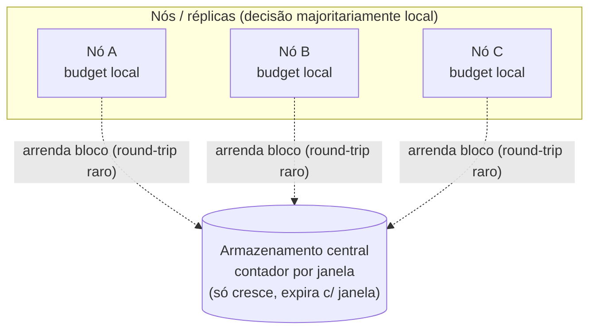

---

## 2. Contrato de entrada e saída

### 2.1 Entrada (request) e saída (decisão)

O contrato de uma requisição individual e sua resposta, independente de transporte ou
serialização:

**Request**

- `dimensão` — o eixo do limite (ex.: `user_id`).
- `valor` — o valor concreto dentro do eixo (ex.: `user-42`).
- `N` (hits) — unidades que esta requisição quer consumir (tipicamente 1).
- `prioridade` — `ALTA` ou `BAIXA`.

Um pedido do cliente é um **lote** de um ou mais requests, avaliado all-or-nothing (§7).

**Decisão (por request)**

- `verdict` — `PERMITIDO` | `NEGADO` | `DESCONHECIDO` (enum compartilhado por alta e baixa).
- `remaining` — estimativa de capacidade restante na janela (0 quando negado).
- `reset_after` — quanto falta para a janela virar.
- `capacity` — a capacidade da política (`requests_per_unit`).

O **resultado do lote** carrega o `verdict` coletivo (§7) mais a decisão de cada item.

### 2.2 Roteamento de uma requisição

Antes de qualquer reserva, resolve-se a política. Sem política casada, a requisição é
**pass-through** (admitida, não cobra nada). Com política, roteia-se por prioridade.

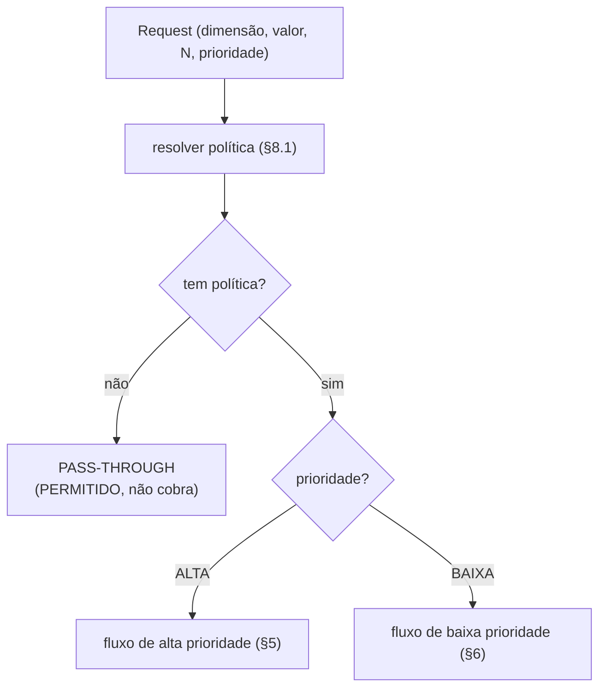

O pass-through é decidido **aqui**, na resolução de política (§8.1) — não dentro do reserve.

---

## 3. Chave determinística de janela

### 3.1 Modelo de política: requests por unidade

A política segue o modelo **Envoy RLS**: cada regra é **`requests_per_unit` + `unit`**, e
**não** uma duração arbitrária.

- **`requests_per_unit`** — a capacidade: quantas requisições são permitidas por **uma**
  unidade de tempo.
- **`unit`** — a unidade da janela: `SECOND`, `MINUTE`, `HOUR`, `DAY`, … A **janela tem
  sempre o tamanho de exatamente uma unit**. Não existe "a cada 10 segundos" nem "a cada
  90 minutos"; existe "N por SECOND", "N por MINUTE", "N por HOUR", "N por DAY".

Ao longo deste documento, "capacidade" significa `requests_per_unit` e "janela" significa o
comprimento de **uma** `unit` (convertido para segundos).

| `unit`   | comprimento da janela | fronteira de alinhamento (epoch/UTC) |
|----------|-----------------------|--------------------------------------|
| `SECOND` | 1 s                   | a cada segundo                       |
| `MINUTE` | 60 s                  | topo do minuto                       |
| `HOUR`   | 3600 s                | topo da hora (UTC)                   |
| `DAY`    | 86400 s               | meia-noite (UTC)                     |

### 3.2 Derivação da chave

Toda a coordenação depende de nós diferentes calcularem **exatamente a mesma chave** para
a mesma janela de tempo.

**Responsabilidade:** transformar `(dimensão, valor, instante atual, unit)` numa chave
estável e no conjunto de números de tempo que os passos de lease e pacing compartilham.

Regras:

- A janela é **alinhada ao epoch (UTC)**, tomando o piso da divisão do instante atual pelo
  comprimento da unit. Não é relativa ao primeiro request nem ao fuso local. Assim todo nó,
  para a mesma janela, converge na mesma chave. (Para units que não dividem o dia de forma
  exata a fronteira "deriva" em relação ao relógio de parede, mas continua idêntica entre
  nós — o que basta para a coordenação.)
- O **início da janela (em segundos do epoch) é embutido na chave**. Cada janela vira uma
  chave distinta; não há "reset" de contador — a janela antiga simplesmente expira (TTL =
  comprimento da unit + um período de carência).
- O valor armazenado na chave é **quanto já foi arrendado** naquela janela, não o que
  resta.
- Cada operação toca **uma única chave**, evitando problemas de multi-shard e espalhando
  buckets naturalmente pelo armazenamento.
- O mesmo instante e a mesma unit calculados no nó são repassados às operações atômicas
  centrais, para que a matemática de janela do nó e do armazenamento **coincidam
  exatamente** (essencial para o pacing — ver §6).

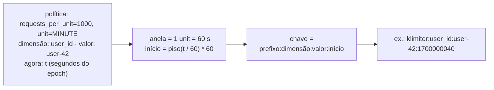

---

## 4. Lease: contador global + budget local

### 4.1 Operação atômica de lease (no armazenamento central)

**Responsabilidade:** conceder, de forma atômica, parte da capacidade restante da janela e
registrar o consumo no contador global.

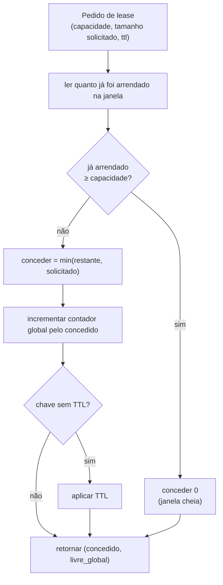

**Contrato.** Entrada: `chave`, `capacidade`, `tamanho_solicitado`, `ttl`. Saída:
`concedido` (de 0 a `tamanho_solicitado`) e `livre_global` (`capacidade − já_arrendado` após
o incremento). Janela cheia → `concedido = 0`. Aplica o TTL só quando a chave ainda não tem.

**Invariante crítica:** o **rollback é sempre local**. Uma vez incrementado, o contador
global nunca devolve unidades. Se o nó arrendou e não usou, a sobra simplesmente expira
com a janela. Isso simplifica enormemente a corretude (ver refund em §7).

### 4.2 Budget local (por nó, por chave-de-janela)

**Responsabilidade:** ser a visão que o nó tem de um bucket, permitindo decidir sem
round-trip e coalescer renovações.

Guarda:

- **Lease restante local** — unidades que *este nó* arrendou e ainda não gastou.
- **Livre global** — unidades não arrendadas por ninguém, conforme a última leitura.
  É **disjunto** do lease local, então a disponibilidade estimada
  (`lease local + livre global`) não conta a mesma unidade duas vezes.
- Um **mecanismo de coalescing single-flight** por bucket, que serializa renovações (no
  máximo uma renovação em voo por vez). Em runtime com threads isso é um lock por bucket;
  em runtime single-threaded/async é **compartilhar a operação de renovação em voo** (ex.:
  a mesma promise/future) — o requisito é "uma renovação por bucket por vez", não um lock
  de thread específico.

E três estados:

- **Já arrendou?** — houve ao menos uma renovação nesta janela. Antes disso,
  disponibilidade zero significa "ainda não arrendou", não "esgotado".
- **Já observou o global?** — o "livre global" reflete uma leitura real (não o default).
  Este estado pode ser **explícito** (um flag) ou **dobrado num snapshot inicial otimista**:
  inicializar o "livre global" como `capacidade` (≡ "ainda não arrendaram nada") faz o
  pré-portão (§6.3) **abster-se naturalmente** antes de qualquer leitura real — ele nunca
  admite por conta própria e, como `0 ≤ já_arrendado` é sempre verdadeiro, ainda pode
  **negar localmente** o que é impossível pela linha (`faltante > linha`) mesmo sem nenhuma
  observação. As duas representações são equivalentes; a otimista dispensa um estado.
- **Esgotado (latch terminal)** — *qualquer* leitura do central reportou livre global ≤ 0.
  Como o contador global só cresce, uma vez cheio permanece cheio; nenhuma renovação futura
  concederá. O latch é escopado à janela e expira com o bucket, então não vaza entre janelas.
  Como ele é aprendido e relido está detalhado em §4.3.

**Evicção do índice local (obrigatória).** Os buckets são por `(dimensão, valor)` e por
janela; com valores de alta cardinalidade (ex.: milhões de `user_id` vistos uma vez), o
índice local de buckets cresce indefinidamente. A implementação **deve** recuperar os
buckets de janelas já vencidas — por uma varredura periódica que remove os expirados, ou
por um TTL/expiração no próprio bucket. É seguro removê-los: o contador central daquela
janela já expirou e qualquer acesso novo a `(dimensão, valor)` cria um bucket de janela
nova. Sem essa recuperação, há **vazamento de memória** proporcional à cardinalidade.

### 4.3 Como o esgotado é aprendido e usado

O estado "esgotado" e o snapshot do livre global não são consultados sob demanda — eles são
**aprendidos** como efeito colateral de *qualquer* toque no armazenamento central e depois
**relidos de graça** pelos caminhos rápidos. Toda leitura cujo livre global volte ≤ 0 latcha
o esgotado:

- renovação que **não** concede nada (global já cheio);
- renovação que **concede, mas zera** o livre global (drenou a última folga);
- probe de pacing somente-leitura;
- lease fundido (tanto quando admite quanto quando nega).

Toda leitura — **mesmo as que negam** — também **atualiza o snapshot do livre global**. É
isso que faz uma rajada colapsar: o primeiro round-trip atualiza o snapshot e os seguintes
decidem localmente.

O snapshot é atualizado **monotonicamente** (dentro da janela só pode **encolher**): como o
contador central só cresce, uma leitura que chegue **fora de ordem** reportando um livre
global *maior* que o já conhecido é **descartada**. Isso mantém o snapshot um lower-bound
apertado do consumo, maximizando o poder de negação do pré-portão (§6.3). É **otimização,
não corretude**: sem o monótono o pré-portão apenas negaria menos (um round-trip extra),
nunca over-admitiria — a admissão é sempre confirmada pelo central (§6.1).

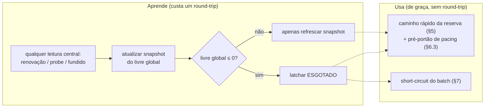

O latch é terminal **dentro da janela** (o contador só cresce) e escopado ao bucket, que
expira com a janela — então não vaza para a janela seguinte.

---

## 5. Fluxo de reserva de alta prioridade

**Responsabilidade do caminho quente:** decidir o mais barato possível, ordenando do menor
para o maior custo, e ir ao armazenamento central só quando inevitável.

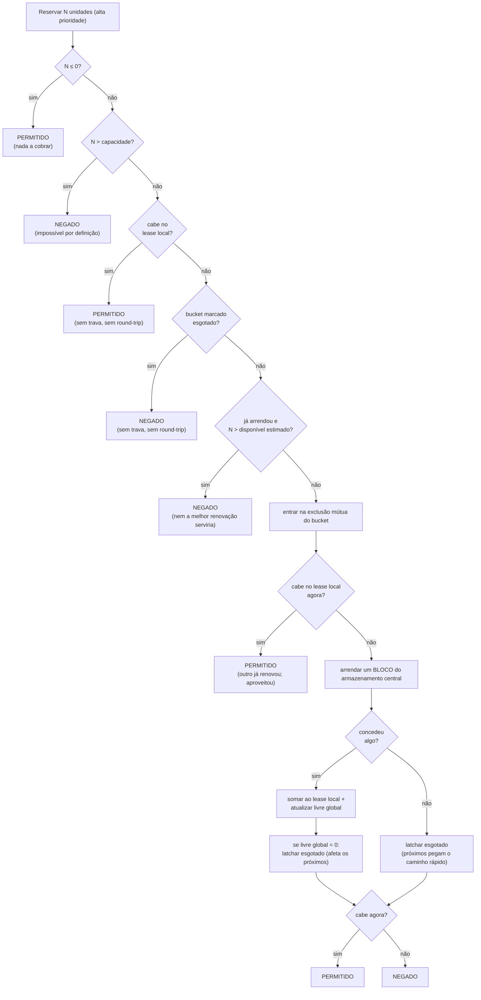

**Prefetch (amortização):** na alta prioridade, em vez de arrendar exatamente N, arrenda-se
um **bloco** = `max(N, prefetch)`. O excedente vira crédito local que serve as próximas
requisições sem round-trip. O tamanho do prefetch vem da política (percentual da
capacidade ou tamanho absoluto). É isso que colapsa muitas requisições num único
round-trip.

**Por que a exclusão mútua importa:** sob chave quente, várias requisições concorrem ao
mesmo tempo. A "exclusão mútua"/"trava" aqui é o **coalescing single-flight do §4.2** (um
lock em runtime com threads; compartilhar a renovação em voo em async): garante que **uma**
faça a renovação enquanto as demais aproveitam o crédito recém-arrendado, em vez de disparar
N round-trips paralelos.

**Verificação dupla sob a trava:** ao entrar na exclusão mútua, o caminho **re-tenta o
consumo local antes de renovar** — outra requisição pode ter renovado o bucket enquanto esta
esperava a trava, tornando a renovação desnecessária.

**A renovação também aprende o esgotado:** uma renovação que concede unidades mas recebe
livre global = 0 latcha o esgotado para os próximos (ver §4.3); *esta* requisição ainda é
atendida do que acabou de ser arrendado — o latch afeta o futuro, não o consumo corrente.

**Ordem de publicação (só importa em caminho rápido lock-free).** Os testes L1/L2/L3 acima
podem ser implementados **sem trava** (a trava serializa apenas a renovação). Se forem
lock-free, o estado renovado precisa ser **publicado em ordem, com visibilidade entre
threads**: primeiro somar o crédito ao **lease local**, depois gravar o **snapshot/latch de
esgotado**, e só então marcar **`arrendou`**. Assim, todo caminho rápido concorrente que
observe `arrendou` (L3) ou `esgotado` (L2) já enxerga o crédito local correspondente e
**nunca nega tendo crédito local disponível** (sub-admissão). Em linguagens com modelo de
memória fraco, isso exige barreiras/atômicos sequencialmente consistentes. **Implementação
mais simples e igualmente correta:** fazer todos os testes (não só a renovação) **sob a
trava do bucket** — aí a ordenação é automática e esta nota não se aplica.

**Resultados possíveis (enum de verdict, compartilhado por alta e baixa):**

- **Permitido** — admitido.
- **Negado** — para a alta, significa janela esgotada ou `N > capacidade`; o motivo "acima da
  linha de pacing" aplica-se **apenas à baixa** (§6).
- **Desconhecido** — falha no backend; a requisição degrada para este estado em vez de
  quebrar.

O **pass-through** não é um resultado do reserve: é decidido antes, na resolução de política
(§2.2 e §8.1).

---

## 6. Pacing: a linha de liberação contínua

Tráfego de **baixa prioridade** não consome o bucket diretamente. Antes, precisa passar por
um **portão de pacing**. A ideia: em vez de liberar toda a capacidade no início da janela,
libera-se **linearmente ao longo do tempo**.

### 6.1 Fluxo de reserva de baixa prioridade (ponta-a-ponta)

Espelha o §5, mas com o portão de pacing antes de qualquer consumo. A baixa **consome o
crédito local disponível e arrenda apenas o faltante** — porém **toda admissão é confirmada
pelo central**, que valida a linha contra o **contador verdadeiro**. O atalho local serve só
para **negar** (pré-portão, §6.3); admitir exige o central (o snapshot local é apenas
lower-bound, nunca admite sozinho — senão furaria a linha).

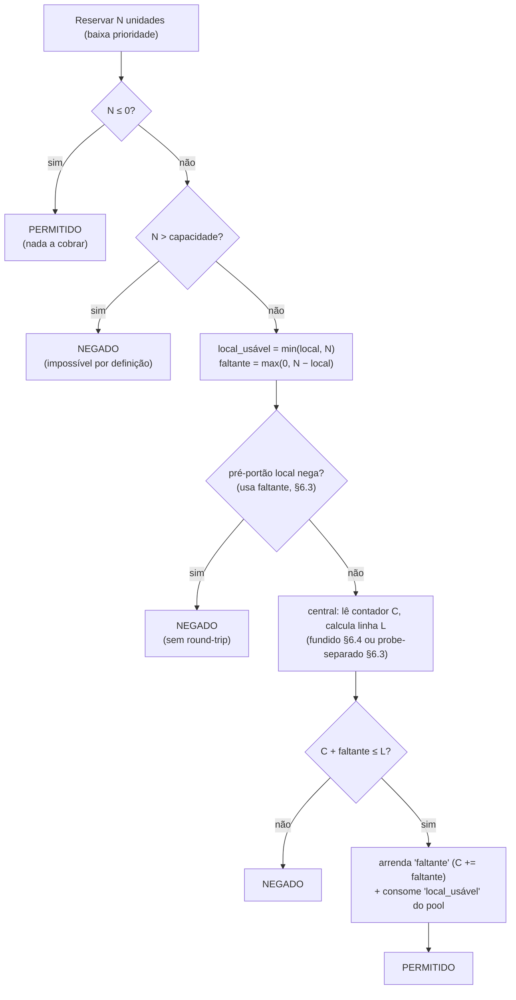

**Por que isto não over-admite.** Servir do local é gated pela linha contra o **contador
verdadeiro**: se a alta tiver arrendado acima da linha (prefetch agressivo), o contador está
acima da linha → `C + faltante ≤ L` é falso → a baixa é **negada**, mesmo havendo crédito
local. A baixa só drena o local **depois** que a linha sobe o suficiente para liberá-lo. Como
`consumo ≤ contador ≤ linha ≤ capacidade`, não há over-admission. (Era exatamente isso que o
atalho antigo — que servia do local *antes* de checar a linha — não garantia.)

**Por que consumir o local em vez de arrendar tudo.** O crédito local já está **contado** no
contador global (foi arrendado antes — tipicamente prefetch da alta no mesmo budget
por-chave, §4.2).
Arrendar N fresco em vez de usá-lo **infla o contador de novo** (dupla contagem) → a linha
enche cedo → a baixa **sub-admite**. Consumir o que já está contado evita essa inflação.
Quando o local sobra (`local ≥ N`), `faltante = 0` e a operação central é só uma **validação
somente-leitura** da linha.

**O round-trip de validação não é dispensável.** Ter crédito local **não** elimina a ida ao
central: a linha precisa do contador verdadeiro. O ganho desta abordagem é de **utilização**
(menos inflação do contador → menos sub-admissão), não de menos round-trips.

**Consumir o local deve ser atômico entre consumidores concorrentes.** A alta prioridade
pode estar drenando o **mesmo** pool de crédito local; para não contar a mesma unidade duas
vezes, o consumo da baixa toma **"até N"** e deriva o faltante do que de fato coube
(`faltante = N − consumido_de_fato`), em vez de ler-e-depois-subtrair. Em runtime com threads
isso exige uma operação atômica de consumo; em runtime single-threaded/async, sem ponto de
suspensão no meio do consumo, já é naturalmente atômico — mesmo espírito do single-flight
do §4.2.

**Dois modos de operação central** (por configuração): o **fundido** (valida a linha e arrenda
o faltante num round-trip atômico, fechando o TOCTOU — §6.4) e o **probe separado** (linha
somente-leitura e, se admitido, um lease do faltante à parte).

### 6.2 A linha de liberação

**Responsabilidade:** dizer quanto já "deveria" ter sido liberado num dado ponto da janela.

```
liberado_até_agora = min( capacidade ,
                          piso( capacidade * decorrido / duração ) + 1 )
```

O `+ 1` admite a primeira unidade já no início da janela. Uma requisição de baixa
prioridade é admitida **somente enquanto**:

```
já_arrendado_por_todos + N  ≤  liberado_até_agora
```

A elegância: `já_arrendado_por_todos` é o **mesmo contador** que a alta prioridade
incrementa. Logo:

- Quando a alta prioridade consome forte, ela enche o contador → empurra a baixa para
  baixo da linha → a baixa é estrangulada para o resíduo.
- Quando a alta está ociosa, a baixa acelera até a capacidade total.

A baixa prioridade **não tem contador próprio** — lê o mesmo contador do lease.

> Quando a baixa serve parte de um crédito local já contado (§6.1), o termo somado ao
> contador é o **faltante** arrendado, não N: o gate efetivo é
> `já_arrendado + faltante ≤ liberado_até_agora`. As fórmulas acima mostram o caso sem
> crédito local (faltante = N).

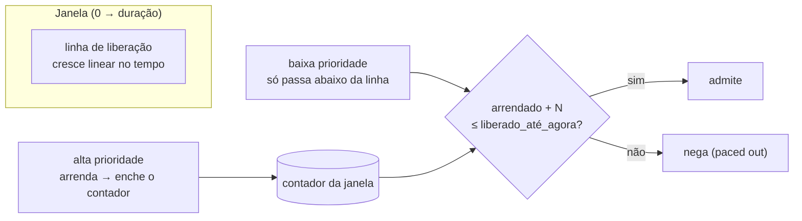

### 6.3 Pré-portão local (evita round-trip)

**Responsabilidade:** negar localmente, sem round-trip, o que o armazenamento central
*também* negaria — nunca admitir por conta própria.

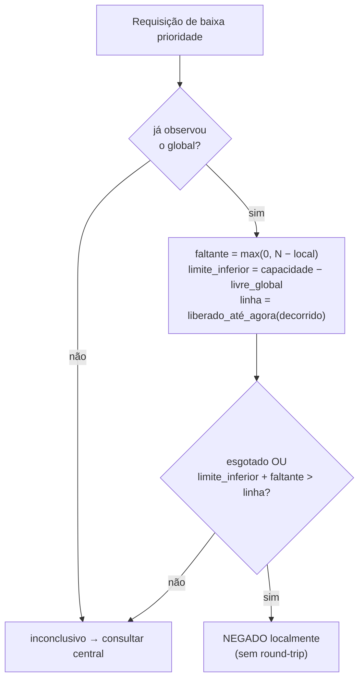

O termo comparado é o **faltante** (`max(0, N − local)`) — só o que iria ao central depois do
crédito local — então o pré-portão nega apenas quando nem o faltante caberia na linha.

Esse pré-portão é **correto** porque:

1. `limite_inferior = capacidade − livre_global` é um limite *inferior* do consumo real
   (o contador só cresce desde a última leitura).
2. O nó calcula a linha com **aritmética inteira exata**; o armazenamento central usa piso
   sobre ponto flutuante. O piso inteiro é sempre `≥` o piso flutuante → o nó **nunca é
   mais permissivo** que o central. Essa exatidão deve valer para **qualquer capacidade**:
   se a linha for computada em inteiros de **largura fixa**, o produto `capacidade ×
   decorrido` precisa ser protegido contra overflow (ampliando a precisão quando necessário),
   senão o piso perderia exatidão e poderia ficar abaixo do piso do central.

O pré-portão só pode **decidir após uma leitura real do global** ter acontecido: antes disso
o snapshot é apenas o default 0, e negar (ou confiar nele) seria infundado. Por isso, sem
observação prévia, a resposta é sempre "inconclusivo → consultar o central".

Quando o pré-portão é inconclusivo, vai ao central. Cada round-trip **atualiza o
snapshot**, então uma rajada de negações **colapsa num único probe**.

**Contrato (probe somente-leitura, no central).** Entrada: `chave`, `capacidade`, `faltante`,
`decorrido`, `duração`. Saída: `admite` (1/0 conforme `contador + faltante ≤ linha`) e
`já_arrendado` (para o nó refrescar o snapshot do livre global). **Não escreve.** Quando
`faltante = 0`, é uma validação pura da linha (`contador ≤ linha`).

### 6.4 Variante fundida: pacear e arrendar num round-trip

Em vez de "probe somente-leitura + lease separado" (dois round-trips), uma operação atômica
**valida a linha E arrenda o faltante de uma vez** — fechando o TOCTOU.

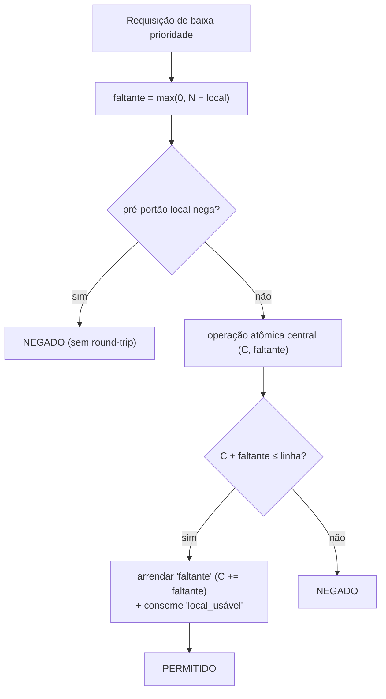

A diferença para o probe-separado é só **atomicidade**: validar a linha e arrendar o faltante
acontecem no mesmo passo, então nenhum outro nó arrenda no meio. Quando `faltante = 0` a
operação degenera num **read** (só valida a linha). Em ambos os modos a admissão é sempre
confirmada pelo central — o crédito local nunca admite sozinho (§6.1).

**Contrato (fundido, atômico).** Entrada: `chave`, `capacidade`, `faltante`, `decorrido`,
`duração`, `ttl`. Saída: `admitido` (1/0) e `livre_global`. Admite sse `contador + faltante ≤
linha`; só escreve (incrementa `faltante`) quando admite **e** `faltante > 0`; caso contrário
é somente-leitura.

### 6.5 Interação entre prioridades (e em N pods)

As regras anteriores, combinadas, produzem o comportamento de prioridade desejado. Esta
seção consolida o que está distribuído entre §5 e §6.

**Alta tem precedência.** A alta prioridade **não passa pelo portão de pacing** (§5):
consome direto do bucket, limitada apenas pela capacidade global da janela. A baixa só é
admitida abaixo da linha de liberação (§6.2). Como ambas escrevem e leem o **mesmo
contador**, cada unidade que a alta arrenda sobe `já_arrendado_por_todos` e empurra a baixa
para baixo da linha.

**A baixa fica com o resíduo.** Enquanto a alta consome forte, a folga da linha
(`liberado_até_agora − já_arrendado_por_todos`) tende a zero e a baixa é estrangulada para
perto de zero. Quando a alta esvazia, a folga reabre e a baixa volta a ser admitida.

**A recuperação é gradual, não instantânea.** A baixa sobe acompanhando a linha, que cresce
linear no tempo — não há salto para 100% de allowed. Se a alta ficar ociosa pelo resto da
janela, a baixa pode chegar até a capacidade total.

```
allowed/s
   ^
cap|     alta cheia                  alta ociosa
   |    (baixa ≈ 0)             (baixa sobe pela linha)
   | alta ██████████░░░░░░░░░░░░░░░░░░░░░░░░░░
   | baixa ...........▁▂▃▄▅▆▇█
   +-------------------------------------------> tempo (dentro da janela)
```

**Não é preempção.** A precedência da alta age por **pressão no contador**, não por tomar de
volta o que já foi concedido. Como o contador só cresce e o rollback é local (§4.1), o que a
baixa já consumiu **não é devolvido** a uma rajada de alta que chegue tarde **na mesma
janela** — a alta disputa apenas a capacidade global restante. A cada janela nova o contador
zera (chave nova, §3.2) e a dinâmica recomeça do início da linha.

**O comportamento se mantém em N pods.** A coordenação é o **contador central compartilhado**,
não estado por-pod: a régua da linha é a mesma para todos. Nenhum pod admite além da linha
porque (a) o pré-portão local nunca é mais permissivo que o central (§6.3) e (b) a baixa só é
admitida pela operação central, que confirma a linha contra o **contador verdadeiro** —
**mesmo quando serve de crédito local**, o admit exige `contador + faltante ≤ linha`, então
nada acima da linha é drenável (§6.1, §6.4). Logo a soma do que os N pods admitem respeita a
linha, e a relação "alta esmaga baixa / alta ociosa libera baixa" vale independentemente do
número de réplicas (sob as premissas de §11).

> **Status de validação.** O comportamento desta seção (esmagamento, recuperação gradual,
> preservação em N pods) e os efeitos quantitativos citados em §10 são **intenção de design**,
> a confirmar por teste de carga — não medições garantidas por este documento.

---

## 7. Batch all-or-nothing

Uma requisição do cliente é um **lote de chaves** (ex.: limitar simultaneamente por
usuário, por IP e por tenant). Regra: **ou todas passam, ou nenhuma cobra nada.**

**Responsabilidade:** resolver a política de cada item, decidir o veredito coletivo e
garantir que um lote rejeitado não deixe consumo em bucket nenhum.

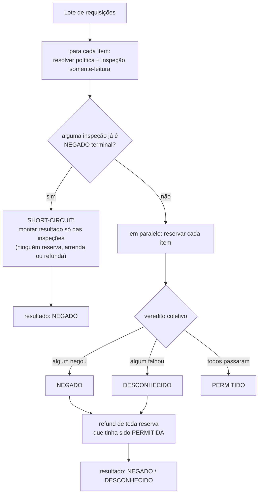

> **Paralelismo é otimização, não correção.** O "em paralelo: reservar cada item" do diagrama
> existe para **sobrepor os round-trips ao central** quando há I/O a sobrepor — não é
> requisito de corretude. O grau de concorrência é definido pela implementação: reservar
> sequencialmente, com concorrência limitada, ou async single-threaded (`Promise.all`,
> `asyncio.gather`) é **igualmente correto**. Itens servidos localmente (alta prioridade que
> cabe no lease) não têm I/O a sobrepor — paralelizá-los só adiciona custo de criar tarefas;
> o ganho do fan-out vem dos itens que **vão ao central**. O short-circuit (§7.2) é sempre
> sequencial de propósito.

### 7.1 Inspeção (pré-passo somente-leitura)

**Responsabilidade:** espelhar, sem mutar nada, apenas as condições de negação *garantidas*:

- pedido ≤ 0 → permitido (nada a cobrar);
- pedido maior que a capacidade → negado;
- bucket esgotado **e** pedido maior que o disponível → negado;
- baixa prioridade acima da linha (pré-portão local) → negado;
- caso contrário → permitido.

Negações "suaves" (otimizações que dependem de estado momentâneo) ficam **de fora** da
inspeção, porque não são garantias.

> **Por que a condição de esgotado é diferente aqui.** No caminho de reserva, o teste de
> esgotado vem *depois* de uma tentativa de consumo local que já falhou, então basta
> "esgotado → negado". Na inspeção **nada foi consumido antes**, então é preciso o termo
> extra "**e** pedido maior que o disponível": um bucket esgotado globalmente ainda pode ter
> lease local sobrando para servir este pedido. Unificar as duas condições (negar na
> inspeção só por estar esgotado) negaria requisições que a reserva atenderia — um bug.

### 7.2 Por que o short-circuit é a grande economia

Sem ele, um lote condenado por *uma* chave esgotada ainda reservaria, arrendaria e
consultaria todas as chaves irmãs, e depois faria rollback de tudo. No cenário quente (uma
chave de baixa capacidade sempre na trava), esse desperdício domina o custo de CPU. O
short-circuit detecta a condenação com trabalho **puramente local e zero round-trips**.

**Precondição: o esgotado precisa ter sido aprendido antes.** A inspeção é somente-leitura
sobre o estado local; ela não vai ao central descobrir nada. Logo, o **primeiro** lote que
encontra um bucket recém-esgotado **não** nasce morto: ele reserva, vai ao central, recebe
"cheio", **aprende** o esgotado (latcha — ver §4.3) e faz refund de tudo. Só os lotes
**seguintes** são natimortos via short-circuit. Em outras palavras, alguém paga o custo uma
vez para que os próximos sejam baratos.

**O short-circuit roda sequencialmente, de propósito.** Por ser trabalho puramente local
(sem reserva, lease, refund ou round-trip), espalhá-lo em paralelo só pagaria o custo de
criar tarefas e propagar contexto, sem nenhuma I/O para sobrepor. O caminho de reserva, ao
contrário, mantém o fan-out — ele pode disparar renovações concorrentes no central.

**Janela de aprendizado (thundering herd).** Entre o bucket esgotar e o latch ser aprendido,
vários lotes concorrentes ainda reservam+refundam antes de o primeiro registrar o esgotado.
É um intervalo **transitório**, amortecido pelo mutex por-bucket (§5) que coalesce as
renovações concorrentes num único round-trip. Não há over-admission — apenas trabalho extra
breve até o latch setar.

### 7.3 Refund trivial

Como o lease só faz rollback **local**, devolver é simplesmente recolocar as unidades no
lease local do nó. Não há nada a compensar no contador global (ele nunca foi "devolvido" — o
crédito local volta a ficar disponível e o resto expira com a janela). Um refund de pedido
≤ 0 é um no-op.

**Efeito do refund sobre o pacing (conservador).** O pacing lê o contador global como régua
da linha, e o refund **não** decrementa esse contador — preservar a invariante "só cresce" é
o que sustenta o latch de esgotado e o lower-bound seguro. Logo, um lote refundado deixa a
linha **empurrada** pelo resto da janela e pode **sub-admitir** a baixa prioridade. É um
desvio **conservador** (nunca leva a over-admission), trade-off deliberado por manter o
contador monotônico.

### 7.4 Robustez: falha de backend e cancelamento

Uma falha do armazenamento central ao reservar **degrada apenas aquele item** para
DESCONHECIDO (em vez de derrubar o lote inteiro); o veredito coletivo então não é PERMITIDO e
tudo que já havia sido reservado é refundado.

Há uma exceção deliberada: o **cancelamento** da operação (cliente desistiu, timeout do lote)
**não** deve ser mascarado como DESCONHECIDO. Ele precisa ser **propagado** para que o
cancelamento desenrole normalmente, abortando os irmãos em andamento, em vez de virar um
veredito falso de "backend indisponível".

---

## 8. Hot reload de políticas

As políticas vivem num **arquivo externo** (que pode ser montado ou aparecer após o boot) e
são recarregadas **sem reiniciar** o serviço.

**Responsabilidade do observador:** detectar mudanças no arquivo e disparar uma recarga
resiliente.

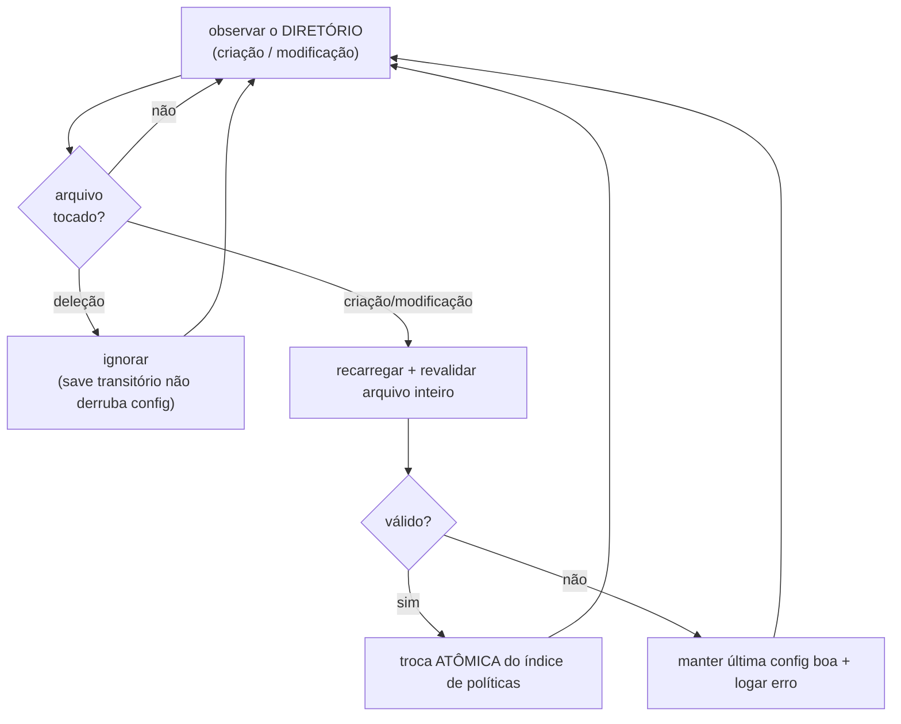

Detalhes que importam:

- Observa o **diretório**, não o arquivo, porque editores salvam via rename/replace e o
  arquivo pode nem existir no boot.
- **Deleção é ignorada** de propósito: um save transitório não deve derrubar a config.
- Arquivo **ausente no boot** → começa com políticas default até ele aparecer.
- Falha de parsing/validação → **mantém a última config boa** e o observador segue vivo.

### 8.1 Troca atômica e lookup

**Responsabilidade do repositório de políticas:** servir leituras sem trava e sempre
consistentes.

- O índice de lookup fica atrás de uma referência **publicada de forma visível entre
  threads**. A recarga **constrói um índice novo e completo** e o substitui de uma vez;
  leituras nunca veem um estado meio-atualizado.
- **Resolução de política** por precedência:

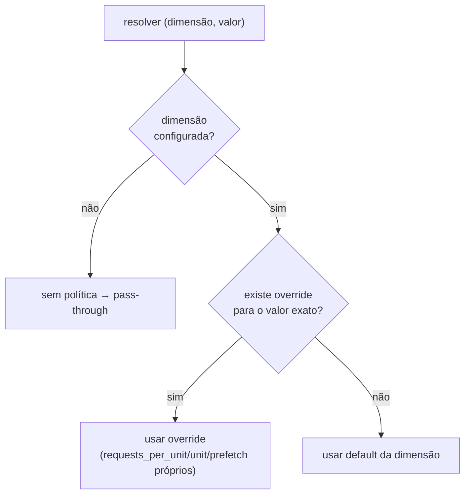

---

## 9. Invariantes de corretude

| Invariante                                                                           | Garante                                                                               |
|--------------------------------------------------------------------------------------|---------------------------------------------------------------------------------------|
| Contador global só cresce na janela                                                  | snapshot local é limite inferior seguro do consumo                                    |
| Rollback é sempre local                                                              | refund trivial, sem corrida no contador global                                        |
| Janela alinhada ao epoch + embutida na chave                                         | todos os nós convergem na mesma chave; sem reset                                      |
| Latch de esgotado é terminal e escopado à janela                                     | caminho rápido sem trava nem round-trip; não vaza entre janelas                       |
| Piso inteiro (nó) ≥ piso flutuante (central)                                         | pré-portão local nunca é mais permissivo que o central                                |
| Pacing lê o mesmo contador do lease                                                  | alta prioridade estrangula naturalmente a baixa; sem contador duplo                   |
| Admit da baixa valida a linha contra o contador verdadeiro                           | servir do crédito local nunca fura a linha (o snapshot local só nega)                 |
| Toda leitura central atualiza o snapshot (até as negações)                           | rajada colapsa num round-trip; esgotado é aprendido uma vez e relido de graça         |
| Operações centrais são RMW atômicas server-side (§11)                                | lease nunca concede acima da capacidade; pacing fundido fecha o TOCTOU                |
| Publicação ordenada no caminho rápido lock-free (crédito local → latch → `arrendou`) | caminho rápido concorrente nunca nega com crédito local disponível (sem sub-admissão) |
| Buckets locais de janelas vencidas são evictados (§4.2)                              | memória limitada sob valores de alta cardinalidade                                    |

---

## 10. Limitações conhecidas

Decorrências diretas do design que um reimplementador deve conhecer.

- **Burst de borda da janela fixa.** Como cada janela é um contador independente que zera na
  virada (§3.2), um cliente pode emitir até ~2× a capacidade no entorno da fronteira (fim de
  uma janela + início da próxima). É inerente ao modelo fixed-window; units menores reduzem o
  valor absoluto do burst.
- **Lease encalhado por prefetch.** Um pod de alta prioridade que arrenda um bloco (§5) e
  fica ocioso ou morre antes de gastá-lo deixa aquela capacidade **encalhada** até a janela
  expirar (o rollback é local; lease em pod morto não volta ao contador global). Com
  capacidade pequena + prefetch grande + muitos pods, isso **subutiliza** o limite. **Mitigado
  na chave mista:** quando há baixa prioridade no mesmo pod, ela consome o prefetch encalhado
  em vez de arrendar fresco (§6.1), recuperando a utilização (dentro da linha). Resta encalhe
  em pod que morre, ou em chave só-alta sem baixa para drenar. Afeta a utilização da alta, não
  a ordenação de prioridade. É **conservador**: subutiliza, nunca over-admite.
- **Sub-admissão por refund.** Um lote refundado deixa o contador global (a régua da linha)
  empurrado pelo resto da janela, podendo sub-admitir a baixa prioridade (§7.3). Também
  conservador: nunca over-admite.
- **Precedência por pressão, não preempção.** Dentro de uma janela, capacidade já concedida à
  baixa não é recuperável por uma rajada tardia de alta (§6.5).
- **Sem idempotência de retry.** O contrato é fire-and-forget: cada chamada admitida
  incrementa o contador. Se o cliente **re-tentar** após uma resposta perdida (timeout/queda
  de rede) de um lote que foi admitido, o consumo é **contado duas vezes**. É conservador
  (estrangula o cliente, nunca fura o limite global), mas o reimplementador que precise de
  exactly-once deve adicionar uma chave de idempotência por requisição — fora do escopo deste
  design.

Todas as limitações acima são **conservadoras** (subutilizam, nunca over-admitem). A
ausência de over-admission depende ainda das **premissas operacionais** de §11.

---

## 11. Premissas operacionais

A garantia de **ausência de over-admission** assume estes requisitos de ambiente. Onde não
forem satisfeitos, o desvio possível é o anotado.

- **Relógios sincronizados (NTP).** A linha de liberação e a fronteira de janela usam o
  relógio de **cada pod** (§3.2). Um pod adiantado calcula a linha mais alta e pode admitir
  além dela. Requisito: relógios sincronizados via NTP, com skew « comprimento da menor
  `unit` em uso. O desvio residual de over-admission é **proporcional ao skew** entre pods.
  (Para skew-zero garantido seria preciso usar o relógio do armazenamento central como fonte
  única do tempo — não adotado, para preservar o alinhamento local exato lease↔pacing.)
- **Armazenamento central durável dentro da janela.** O contador por janela é a verdade
  global. Um failover/restart que **perca** o contador no meio da janela zera a contagem e
  causa over-admission até a janela expirar. Requisito: o armazenamento central **deve** ser
  configurado durável/persistente o suficiente para sobreviver à janela (replicação/persistência
  conforme a tecnologia escolhida).
- **Operações centrais atômicas (read-modify-write).** As três operações do central — lease
  (§4.1), probe de pacing (§6.3) e lease fundido (§6.4) — **devem** executar como um
  read-modify-write **atômico server-side**: ler o contador, calcular e escrever, sem
  interleaving de outro nó no meio. Em Redis isso é um script Lua; em outro backend, uma
  stored procedure ou transação serializável. Implementá-las como comandos separados (ex.:
  GET depois SET) **quebra a corretude**: o pacing fundido perde a atomicidade que fecha o
  TOCTOU (§6.4) e o lease pode conceder acima da capacidade sob concorrência. Este é o
  principal requisito ao portar para um armazenamento que não seja Redis.

---

## Ordem sugerida de implementação

1. **Chave determinística** + operação atômica de lease.
2. **Budget local** com os caminhos rápidos (cabe local / esgotado / não cabe) + **evicção**
   dos buckets de janelas vencidas (§4.2).
3. **Batch all-or-nothing** com inspeção, short-circuit e refund.
4. **Pacing** com a linha de liberação (pré-portão local + variante fundida).
5. **Hot reload** com troca atômica.

Os passos 1–3 já entregam um rate limiter distribuído correto; 4–5 são as otimizações de
qualidade de serviço e operação.
