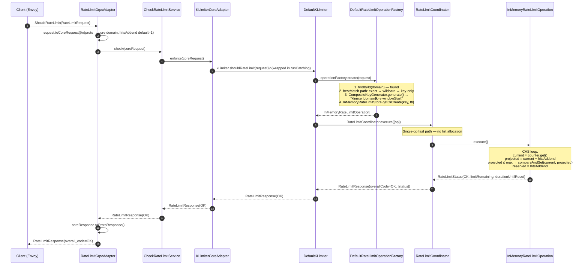
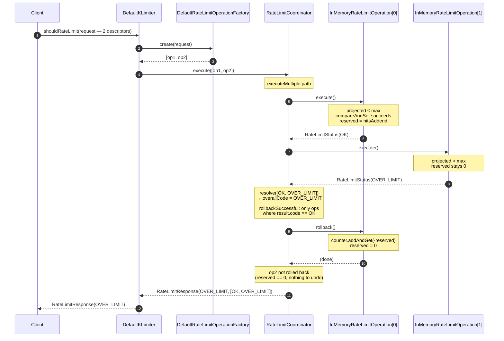
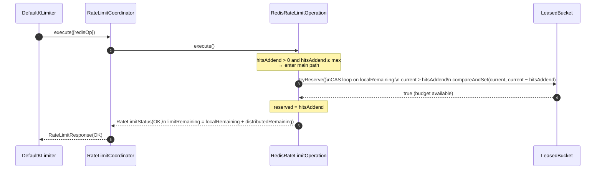
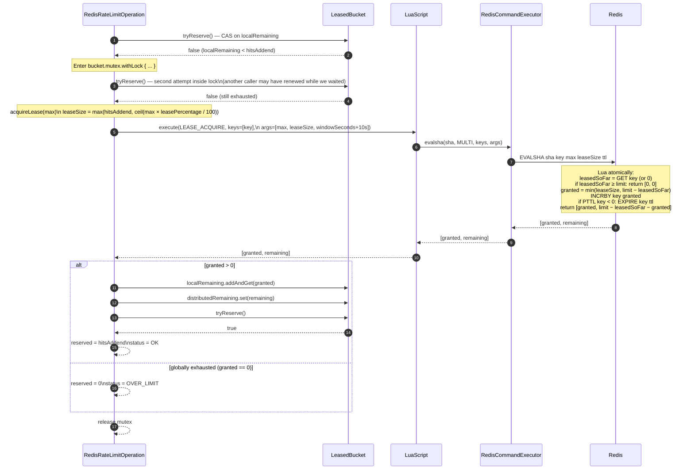
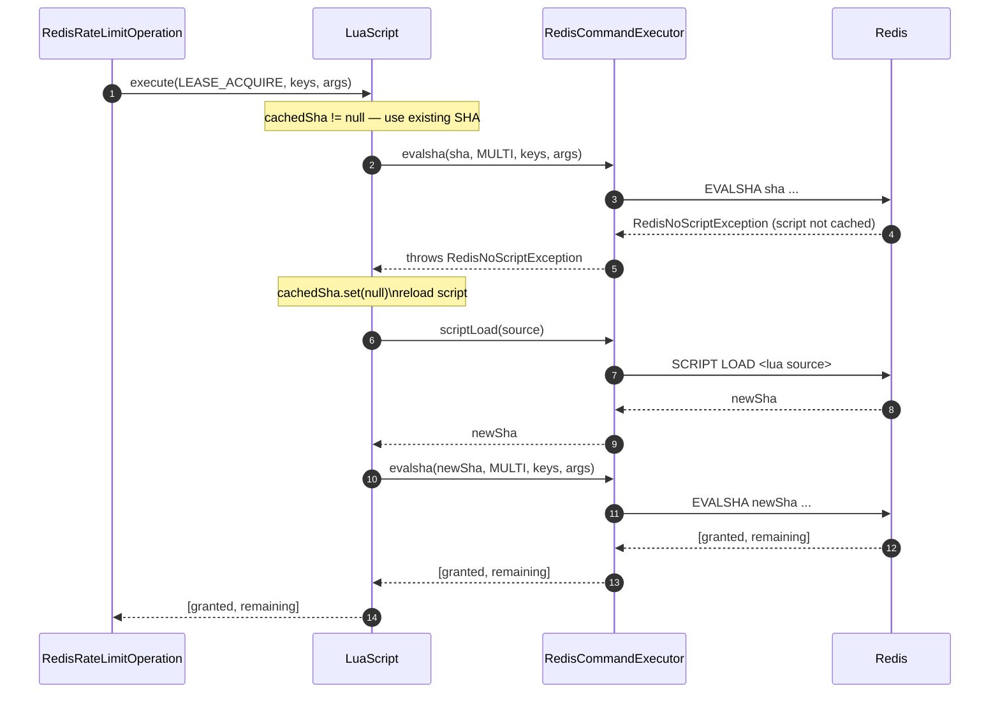
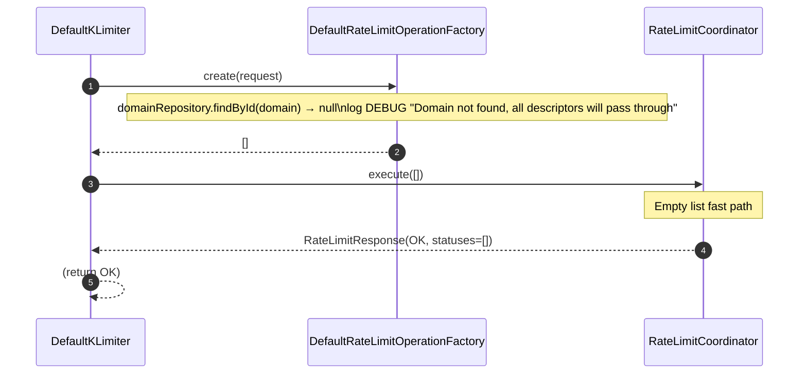

# Request Flows

All rate-limit checks are coroutine-suspended (`suspend`). The diagrams below use the actual class names from the source tree.

**See also:** [Architecture](ARCHITECTURE.md) — component overview · [Algorithms](ALGORITHMS.md) — decision flowcharts and state machines

---

## 1. Happy path — single descriptor, in-memory backend

The coordinator's **single-operation fast path** skips list allocation entirely.

---

## 2. Rollback path — multi-descriptor, second descriptor over limit

The coordinator **always executes all operations first**, then resolves the overall code, then rolls back every reservation that succeeded.

> **Note on rollback failure**: each `rollback()` call is wrapped in `runCatching`. A failing rollback is logged as `WARN` but does not prevent the remaining rollbacks from running.

---

## 3. Redis backend — local budget available (no Redis round-trip)

The hot path is a single CAS against `LeasedBucket.localRemaining`. Redis is never contacted.

---

## 4. Redis backend — local budget exhausted, lease renewal

When the local budget runs dry, concurrent callers coalesce behind a per-bucket `Mutex` so that exactly one renewal goes to Redis.

---

## 5. Redis backend — NOSCRIPT recovery

If Redis evicts the cached Lua script (restart, failover, SCRIPT FLUSH), the `LuaScript` wrapper recovers transparently.

---

## 6. Domain not found — unconditional pass-through

If the request carries a `domain` that has no matching `RateLimitDomain` in the repository, the operation factory returns an empty list and the coordinator immediately responds `OK`.

