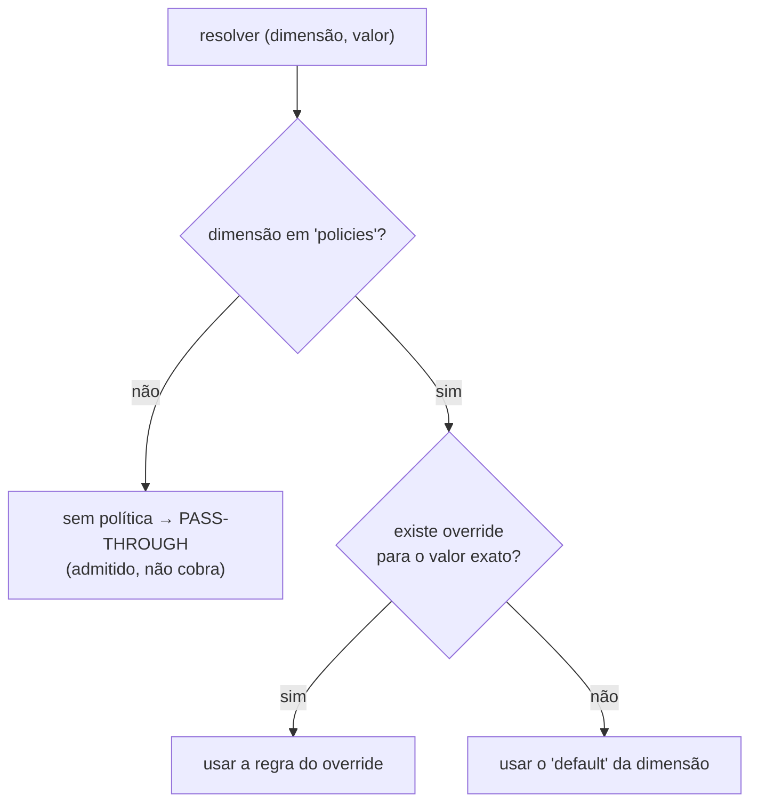

# Políticas — klimiter

Define o **formato do arquivo de políticas** (`config/policies/policies.yaml`), sua **validação**
por JSON Schema e como ele é resolvido em runtime. É a fonte da verdade do **contrato de
configuração** dos limites — não da lógica que os aplica (essa é o `DESIGN-CONCEITUAL-V2.md`).

> **Onde este documento se encaixa.**
>
> | Documento | Responde | Fonte da verdade de |
> |-----------|----------|---------------------|
> | [`DESIGN-CONCEITUAL-V2.md`](DESIGN-CONCEITUAL-V2.md) | **o quê** — fluxos, invariantes, premissas | comportamento |
> | [`ARQUITETURA.md`](ARQUITETURA.md) | **como o código é estruturado** — camadas, fronteiras | estrutura |
> | **`POLITICAS.md`** (este) | **como configurar limites** — formato, schema, resolução | configuração de políticas |
> | [`VARIAVEIS-DE-AMBIENTE.md`](VARIAVEIS-DE-AMBIENTE.md) | configuração via ambiente | configuração de runtime |
>
> Referências `§N` apontam para seções do [`DESIGN-CONCEITUAL-V2.md`](DESIGN-CONCEITUAL-V2.md).
> Se o formato mudar, atualize **este documento e o schema** no mesmo PR.

---

## Índice

1. [Arquivos e localização](#1-arquivos-e-localização)
2. [Formato](#2-formato)
3. [Campos de uma regra](#3-campos-de-uma-regra)
4. [Resolução de política](#4-resolução-de-política)
5. [Validação](#5-validação)
6. [Hot reload](#6-hot-reload)

---

## 1. Arquivos e localização

```
config/policies/
├─ policies.yaml          # o catálogo de limites (editável; recarregado a quente, §6)
└─ policies.schema.json   # JSON Schema (draft 2020-12) que valida o policies.yaml
```

O adapter `adapter.outbound.policy` carrega e observa esse arquivo, implementando a porta
`PolicyRepository` (ver [`ARQUITETURA.md`](ARQUITETURA.md) §3). O caminho é **configurável** pela
propriedade `klimiter.policies.path` (env `KLIMITER_POLICIES_PATH`); o default é
`config/policies/policies.yaml`, relativo ao diretório de trabalho — ver
[`VARIAVEIS-DE-AMBIENTE.md`](VARIAVEIS-DE-AMBIENTE.md). O arquivo **pode estar ausente no boot** —
nesse caso o serviço começa com políticas default (tudo pass-through) até ele aparecer (§8).

---

## 2. Formato

O arquivo é um **mapa de dimensão → política**. Uma *dimensão* é o eixo do limite (ex.:
`user_id`, `ip`, `tenant`); cada dimensão tem um `default` obrigatório e `overrides` opcionais
por valor exato.

```yaml
# yaml-language-server: $schema=./policies.schema.json
version: 1

policies:
  user_id:                       # dimensão (eixo do limite)
    default:                     # regra para qualquer valor sem override
      requests_per_unit: 1000    # capacidade (§3.1)
      unit: MINUTE               # SECOND | MINUTE | HOUR | DAY
    overrides:                   # exceções por valor exato (§8.1)
      service-account:
        requests_per_unit: 50000
        unit: MINUTE
  ip:
    default:
      requests_per_unit: 100
      unit: SECOND
```

| Chave | Obrigatório | Descrição |
|-------|-------------|-----------|
| `version` | sim | Versão do formato. Atual: `1`. |
| `policies` | sim | Mapa dimensão → política. Ao menos uma dimensão. |
| `policies.<dimensão>.default` | sim | Regra aplicada a valores sem override. |
| `policies.<dimensão>.overrides` | não | Mapa valor exato → regra. |

---

## 3. Campos de uma regra

Uma **regra** (`default` ou cada `override`) segue o modelo **Envoy RLS**: capacidade por uma
unidade de tempo, não uma duração arbitrária (§3.1).

| Campo | Obrigatório | Tipo | Descrição |
|-------|-------------|------|-----------|
| `requests_per_unit` | sim | inteiro ≥ 1 | Capacidade: requisições permitidas por **uma** `unit`. |
| `unit` | sim | enum | Unidade da janela: `SECOND`, `MINUTE`, `HOUR`, `DAY`. |
| `detailed_metric` | não | booleano | Liga o contador por policy `klimiter.policy.reserve` desta regra (ver OBSERVABILIDADE.md). Default **`true`** na regra `default` da dimensão e **`false`** nos `overrides`. |

A **janela tem sempre o tamanho de exatamente uma `unit`** (§3.1) e é alinhada ao epoch/UTC
(§3.2). Não existe "a cada 10 segundos" nem "a cada 90 minutos".

| `unit` | comprimento da janela | fronteira de alinhamento (epoch/UTC) |
|--------|-----------------------|--------------------------------------|
| `SECOND` | 1 s | a cada segundo |
| `MINUTE` | 60 s | topo do minuto |
| `HOUR` | 3600 s | topo da hora (UTC) |
| `DAY` | 86400 s | meia-noite (UTC) |

> **`prefetch` foi removido** (migração para o `DESIGN-CONCEITUAL-V2.md`): no V2 não há lease
> local a amortizar — toda admissão é decidida no contador central (§4/§8.1). Um arquivo que
> ainda contenha `prefetch` é **rejeitado no carregamento** como campo desconhecido; remova o
> bloco antes de atualizar.

### Métrica detalhada por policy

`detailed_metric` liga o contador `klimiter.policy.reserve` para a regra, com a identidade da policy
embutida no **nome** do meter (`...reserve.<dimensão>` para a `default`; `...reserve.<dimensão>.<valor>`
para um `override`) e `priority`/`status` como tags. O default é **assimétrico** — `true` na `default`
da dimensão (cardinalidade baixa, uma por dimensão) e `false` nos `overrides` (opt-in, pois o valor do
override aparece no nome do meter; ver a nota de cardinalidade em OBSERVABILIDADE.md). Os meters são
reconciliados no hot reload: criados ao entrar na config e removidos ao sair.

---

## 4. Resolução de política

Para `(dimensão, valor)`, a precedência é (§8.1):



O **pass-through** é decidido aqui, na resolução — não dentro do reserve (§2.2). Uma dimensão
ausente do mapa nunca cobra nada.

---

## 5. Validação

A integridade do `policies.yaml` é garantida em três níveis. O `policies.schema.json` (JSON
Schema draft 2020-12) é o **contrato legível** do formato; o runtime aplica as **mesmas regras**
por parse tipado:

1. **Editor** — o comentário `# yaml-language-server: $schema=./policies.schema.json` no topo do
   arquivo dá autocomplete e erros inline contra o schema (VS Code com a extensão YAML, IntelliJ,
   etc.).
2. **Runtime** — o loader (`adapter.outbound.policy`) faz **parse tipado estrito**: campos
   desconhecidos são rejeitados (`FAIL_ON_UNKNOWN_PROPERTIES`) e cada valor passa pelas
   **invariantes dos Value Objects** do `core.policy` (capacidade ≥ 1, `unit` no enum,
   `default` presente, `version` = 1). É equivalente ao
   schema, sem acoplar um motor de JSON Schema em runtime. Arquivo inválido → **mantém a última
   config boa** e loga o erro (§6).
3. **Build/test** — testes carregam o `policies.yaml` versionado pelo próprio loader, garantindo
   que o exemplo permanece válido e que exemplo e código não divergem.

As regras estruturais cobertas (em ambos os níveis): `version` correta, ao menos uma dimensão,
`default` presente, `requests_per_unit` inteiro ≥ 1, `unit` num enum fechado
(`SECOND`/`MINUTE`/`HOUR`/`DAY`) e nenhum campo desconhecido — para pegar erros de digitação
cedo (inclusive o `prefetch` legado, rejeitado desde a migração V2).

> **Knobs globais não vivem aqui.** A carência de TTL (§3.2) e a conexão com o armazenamento
> central são configuração de runtime — ficam em
> `application.yaml`/ambiente (ver [`VARIAVEIS-DE-AMBIENTE.md`](VARIAVEIS-DE-AMBIENTE.md)), não no
> `policies.yaml`, que é só o catálogo de limites por dimensão.

---

## 6. Hot reload

As políticas são recarregadas **sem reiniciar** o serviço (§8). Um observador (`WatchService` do
JDK, gerenciado como `SmartLifecycle`) acompanha o **diretório** do arquivo (não o arquivo),
porque editores salvam via rename/replace:

- **criação/modificação** → recarrega, **revalida o arquivo inteiro** (§5) e, se válido, faz a
  **troca atômica** do índice de políticas; leituras nunca veem estado meio-atualizado;
- **deleção** → ignorada de propósito (um save transitório não derruba a config);
- **arquivo ausente no boot** → começa com políticas default e passa a valer assim que ele aparece;
- **falha de parsing/validação** → mantém a última config boa e loga o erro; o observador segue vivo.

Eventos em rajada (um único save costuma gerar vários eventos) são **coalescidos** por um debounce
configurável — `klimiter.policies.reload-debounce` (default 200ms, ver
[`VARIAVEIS-DE-AMBIENTE.md`](VARIAVEIS-DE-AMBIENTE.md)): após o último evento, espera-se esse
intervalo de silêncio e recarrega-se **uma só vez**.

### 6.1 Limitação conhecida: ConfigMap no Kubernetes

O hot reload **não detecta** a atualização de um `ConfigMap` montado como volume. O kubelet propaga
updates por uma **troca atômica de symlink**: o conteúdo novo é gravado num diretório temporário e o
symlink interno `..data` é trocado para apontar a ele. O nome do arquivo vigiado (`policies.yaml`)
nunca sofre `ENTRY_CREATE`/`ENTRY_MODIFY` — os eventos chegam para `..data`/`..data_tmp` e são
descartados pelo filtro por nome do observador. Na prática, **editar a ConfigMap não recarrega as
políticas até o pod reiniciar**, silenciosamente.

Enquanto o observador não tiver um fallback de polling (mtime/hash do arquivo resolvido), aplique
mudanças de política em Kubernetes com um **restart controlado** — o procedimento está em
[`deployments/README.md`](../deployments/README.md). Fora de volumes de ConfigMap (arquivo real em
disco, ou editado no host e montado via bind), o hot reload funciona normalmente.
